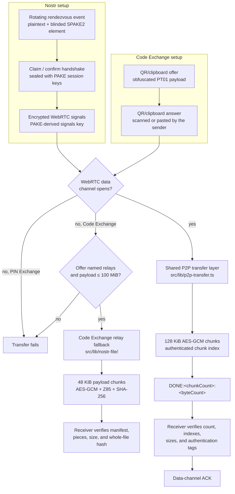
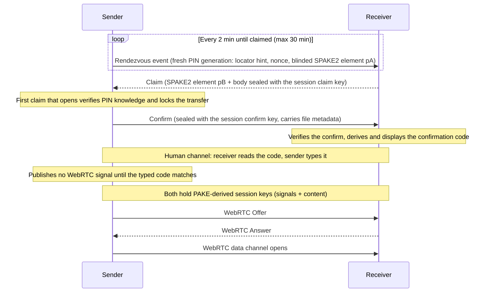
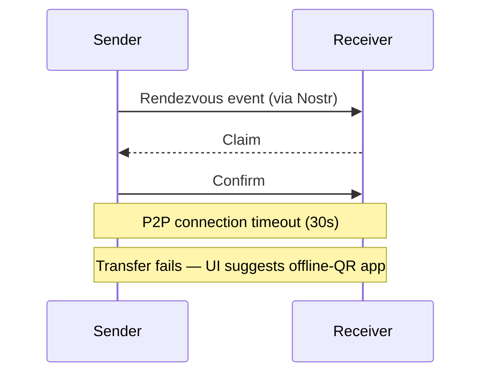
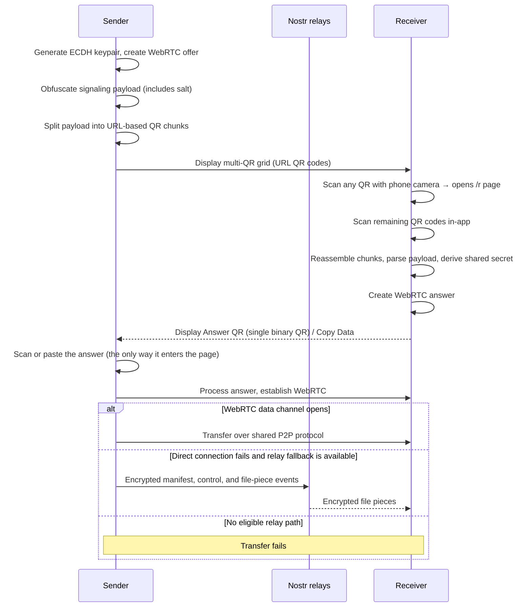
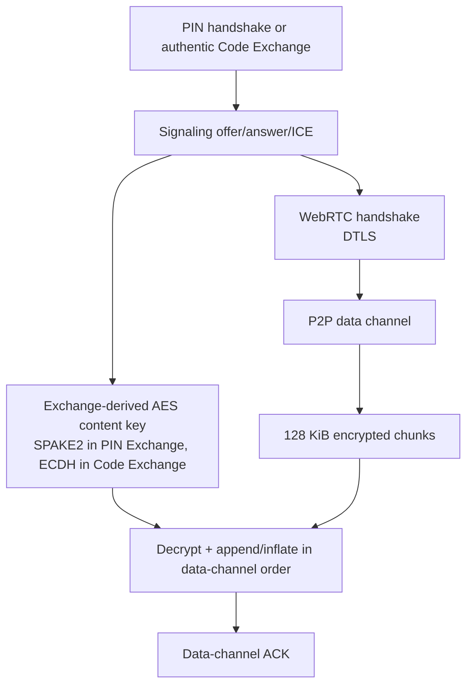

# Architecture

## Overview

pTransfer is a browser-based encrypted file and folder transfer application. Its two WebRTC-based modes are rotating-PIN-authenticated Nostr signaling and Code Exchange, whose offer and receiver answer are both handed over by QR or copy/paste. Both prefer direct P2P transfer over WebRTC. Code Exchange can instead carry files up to 100 MiB through public Nostr relays when a direct connection cannot be established and the offer named usable relays; PIN Exchange has no data-path fallback. In PIN Exchange the content-encryption key comes from a PIN-driven SPAKE2 password-authenticated key exchange; in Code Exchange it comes from an ephemeral ECDH exchange authenticated by the QR/clipboard offer path. A third mode publishes a v3 onion service and carries the transfer through Tor without WebRTC; it is specified in [TOR_TRANSPORT.md](TOR_TRANSPORT.md).

## Implementations

Two implementations exist. This app is the reference one; the other is
[ptransfer-cli](https://github.com/andrewtheguy/ptransfer-cli), the companion
command-line app for headless machines and terminals, which implements PIN
Exchange (with anonymous signaling behind its `tor` cargo feature) and the Tor
onion transport, but not Code Exchange or the Nostr file relay. Either end of a
transfer may be a browser tab or the CLI. What the two must agree on is
specified in [INTEROP_PROTOCOL.md](INTEROP_PROTOCOL.md),
[TOR_TRANSPORT.md](TOR_TRANSPORT.md), and
[ANONYMOUS_SIGNALING.md](ANONYMOUS_SIGNALING.md); everything else in this
document is web-only design rationale.

Those three are the source of truth, and they live only here — the CLI
implements against them instead of keeping a copy, and documents its own
internals in its own repo. Each carries a *Changing this document* section
naming the short list that actually binds another implementation, and the
coordination value that moves when that list does; an edit anywhere else in
them, this document included, asks nothing of the CLI.

## Core Principles

1. **Direct First, One Relay Fallback**: Both WebRTC-based modes try a direct data channel. PIN Exchange stops if that connection fails. Code Exchange can fall back to the Nostr file-relay protocol when its offer named usable relays and the payload is no larger than 100 MiB.
2. **Single P2P Transfer Path**: `src/lib/p2p-transfer.ts` is the only file-transfer implementation used after signaling opens a WebRTC data channel. Both signaling methods use its 128 KiB AES-GCM chunks, `DONE:<chunkCount>:<byteCount>`, and data-channel `ACK` framing on the direct path.
3. **Separate Relay Transfer Path**: `src/lib/nostr-file/` implements Code Exchange's fallback: whole-payload deflate for single files (identity for already-compressed generated ZIPs), 48 KiB payload chunks, AES-256-GCM, Z85, an encrypted control channel, and a whole-file SHA-256 check.
4. **Bounded P2P Receive Storage**: Direct receivers append authenticated chunks in reliable data-channel order to an adaptive sink: memory through 100 MiB, then OPFS. The relay fallback is capped at 100 MiB and materializes its payload in memory while hashing, compressing, assembling, and verifying it.
5. **Method-Specific Setup and Failure Handling**: PIN Exchange uses Nostr for its PAKE handshake and WebRTC signals. Code Exchange hand-carries both the offer and the answer, and may reuse the relays the offer named as the fallback's encrypted control channel.
6. **PIN Locates and Authenticates via PAKE (PIN Exchange)**: A rotating 12-character, case-sensitive letters-and-digits PIN locates the sender's rendezvous event and drives a SPAKE2 (RFC 9382, P-256) password-authenticated key exchange. Content and signaling keys are HKDF derivations off the SPAKE2 shared secret — which mixes fresh ephemeral scalars from both sides — so nothing published to relays can test a PIN guess offline, and a PIN recovered after the fact decrypts nothing.
7. **Confidentiality and Authenticity, Not Availability**: The system defends what is transferred and who receives it. It does not guarantee completion: signaling and the Code Exchange fallback depend on third-party relays, and direct P2P setup is STUN-only. Failure — accidental or induced — costs a retry, not confidentiality or integrity. See *Availability Is a Non-Goal*.

## Signaling Methods

> [!NOTE]
> Only PIN Exchange and the shared data-channel transfer layer are part of the
> cross-implementation contract. [INTEROP_PROTOCOL.md](INTEROP_PROTOCOL.md)
> specifies that subset normatively and carries the interop protocol version;
> Code Exchange and the Nostr relay fallback are web-only until they stabilize.
> This document is the design rationale for all of it.

By default, Nostr is used for signaling. Code Exchange and the Tor onion transport are available as alternatives under the Transfer mode selector on the send page. The receive page has no selector: it infers the mode from what the receiver pastes or scans. Both sender and receiver still use the same method.

The table below compares the two WebRTC-based modes. The third — **Tor Onion Service** — is not a signaling method at all: there is no signaling and no WebRTC, because the sending tab publishes a v3 onion service and the file travels inside the Tor circuit. It is specified in [TOR_TRANSPORT.md](TOR_TRANSPORT.md) — the normative contract shared with ptransfer-cli — and implemented here as described in [TOR_BROWSER.md](TOR_BROWSER.md); it shares only this document's crypto primitives and the transfer layer below.

| Feature | Nostr / PIN Exchange (Default) | Code Exchange (Hand-Carried Offer) |
|---------|-----------------|---------------------------------------|
| Signaling path | Decentralized relays | Offer and answer both by QR/copy-paste; the sender scans or pastes the answer |
| ICE servers | STUN only (Google + Cloudflare); no TURN | STUN only (same WebRTC config); no TURN |
| File transport | Direct WebRTC only | Direct WebRTC first; automatic Nostr relay fallback up to 100 MiB when available |
| Privacy | Public rendezvous routing record; handshake and WebRTC signals sealed after PAKE. Optional anonymous signaling hides both devices' IP addresses from the Nostr relays, but never from the WebRTC peer | Offer and answer are only obfuscated and must be delivered authentically; fallback file pieces are encrypted |
| Complexity | More complex | Hand-carried code (QR or copy/paste) |
| Internet Required | Yes | No (if on same local network) |
| Network Requirement | Internet access to common signaling relays plus a direct ICE route | Same local network without internet; with internet, either a direct ICE route or a usable relay fallback |
| Recommended For | Remote transfers, or when carrying a long code is impractical | Offline/local transfers, or keeping the offer off signaling relays |

## Transfer Flow

pTransfer has two method-specific setup paths and prefers one shared P2P transfer path. If WebRTC opens, both modes call `src/lib/p2p-transfer.ts`. If it does not, PIN Exchange fails, while an eligible Code Exchange switches to `src/lib/nostr-file/`.

### Unified Transfer Flow (All Signaling Methods)



Both modes derive their keys from an ephemeral exchange — PIN Exchange from the SPAKE2 run the PIN authenticates, Code Exchange from an ECDH exchange whose authenticity rests on the QR/clipboard offer path. On direct connections, `src/lib/p2p-transfer.ts` receives the content key plus an open data channel and runs the same encrypted chunk, validation, `DONE`, and `ACK` flow for both setup methods. The Code Exchange relay fallback derives a distinct session id and file key from the ECDH secret and uses its own manifest/control/chunk protocol.

### Signaling Setup Diagrams

### PIN Exchange - Signaling Setup


### PIN Exchange - P2P Connection Failure


### Code Exchange Mode - Signaling Setup


Relays carry no signaling in Code Exchange. The separate Code Exchange relay
fallback may carry encrypted file pieces after the direct WebRTC attempt fails.

**Requirements:**
- Receiver needs a phone camera to scan the sender's URL QR codes (or can use clipboard copy/paste as fallback)
- Sender needs a camera or clipboard to take the receiver's answer back in

**Network Requirements:**
- **With internet**: Can work across different networks when ICE finds a direct route; if it cannot, an eligible file up to 100 MiB can use the Nostr relay fallback
- **Without internet**: Devices must be on the same local network (Wi-Fi, LAN, etc.); the relay fallback is unavailable
- **Not air-gapped**: Requires some network connectivity between devices

**How it works:**
- With internet: Google and Cloudflare STUN servers help discover direct ICE candidates. TURN is not configured; when restrictive NAT or firewall rules prevent a direct connection, an eligible Code Exchange can use the Nostr file-relay fallback instead.
- Without internet: WebRTC discovers local ICE candidates directly, connection establishes via local IP addresses

**QR Code Format:**

*Sender → Receiver (Offer):* Multi-QR URL-based chunking
- Offer payload uses `maxDataBytes = 400` payload bytes per chunk (headers are added after payload slicing).
- Chunk wire format (raw bytes before base64url):
  - `chunk_index`: `u8` (1 byte, 0-based)
  - `total_chunks`: `u8` (1 byte, valid range `1..=255`)
  - `payload_crc32_be_u32` (carried only in chunk `0`): 4-byte big-endian CRC-32/ISO-HDLC over the full reassembled payload (poly `0x04C11DB7`, reflected input/output, init `0xFFFFFFFF`, xorout `0xFFFFFFFF`; reflected table form `0xEDB88320`)
  - Chunk `0`: `[chunk_index:u8][total_chunks:u8][payload_crc32_be_u32][data]`
  - Chunk `1..N-1`: `[chunk_index:u8][total_chunks:u8][data]`
- Header overhead and usable payload bytes:
  - Chunk `0` header size: `6` bytes (`chunk_index` 1 + `total_chunks` 1 + `payload_crc32_be_u32` 4) -> usable payload data up to `400` bytes, raw chunk bytes up to `406`.
  - Chunk `1..N-1` header size: `2` bytes (`chunk_index` 1 + `total_chunks` 1) -> usable payload data up to `400` bytes, raw chunk bytes up to `402`.
- Chunk data rebalancing (to avoid a tiny last QR payload):
  - After `total_chunks = ceil(payload_bytes / 400)` is chosen, data bytes are distributed evenly: `base_size = floor(payload_bytes / total_chunks)`, `remainder = payload_bytes % total_chunks`.
  - The first `remainder` chunks carry `base_size + 1` data bytes; the remaining chunks carry `base_size` data bytes (difference between chunk payload sizes is at most 1 byte).
- Base64url size expansion (for raw chunk length `n` bytes, unpadded):
  - `n % 3 == 0` -> encoded length `4 * (n / 3)`
  - `n % 3 == 1` -> encoded length `4 * floor(n / 3) + 2`
  - `n % 3 == 2` -> encoded length `4 * floor(n / 3) + 3`
- Typical `1200`-byte payload example:
  - `total_chunks = ceil(1200 / 400) = 3` (data slices are `400`, `400`, `400` bytes).
  - Chunk `0`: `406` raw bytes -> `542` base64url chars in hash payload -> URL fragment `#` length `543` chars (`/r#` length `545`, excluding origin).
  - Chunk `1`: `402` raw bytes -> `536` base64url chars in hash payload -> URL fragment `#` length `537` chars (`/r#` length `539`, excluding origin).
  - Chunk `2`: same as chunk `1`.
- Limits implied by the `u8` headers:
  - Maximum chunks: `255` (`chunk_index` valid range `0..254`, with `chunk_index < total_chunks`)
  - With `400` data bytes per chunk, maximum payload size is `102,000` bytes (`255 * 400`) before base64url encoding.
- CRC32 sequencing and failure handling:
  - Scope: this CRC-32 is a **signaling-payload error-detection** checksum for multi-QR reassembly only (it detects a misread/garbled QR before the offer is parsed). It is **not** file-content integrity and is not a substitute for it — the direct path uses per-chunk AES-GCM authentication, while the relay fallback uses per-piece AES-GCM plus a whole-file SHA-256 check.
  - CRC32 is carried only in chunk `0`; receivers MUST buffer chunk `1..N-1` data until chunk `0` is received (this spec does not define a streaming-without-chunk-0 mode).
  - CRC32 validation is deferred until full reassembly is complete and chunk `0` (with `payload_crc32_be_u32`) is available.
  - On CRC32 failure after full reassembly, receivers MUST drop the reassembled payload, log a checksum/protocol error, and fail the current transfer attempt (retry/rescan is an implementation-level recovery action).
- Each chunk is base64url-encoded and embedded in a URL: `{origin}/r#{base64url}`
- Deployment requirement: app must be hosted at domain root (no subpath), because chunk URLs are built from `window.location.origin` and append `/r` directly
- Displayed as a grid of URL QR codes, each scannable by a phone's native camera
- For a typical `1200`-byte offer: `3` QR codes. Single-chunk payloads (`≤400` payload bytes) produce `1` QR code.
- Copy/paste fallback: base64-encoded full binary for clipboard

*Receiver → Sender (Answer):* Single binary QR code
- Answer payloads are smaller (no file metadata) and use a single binary QR code (8-bit byte mode)
- The sender is already in-app with scanner active, so URL navigation is unnecessary

## Key Components

### Cryptography (`src/lib/crypto/`)

| Component | Description |
|-----------|-------------|
| `pin.ts` | Rotating PIN: generation, weighted checksum, kind classification by length, locator extraction, and the locator-keyed rendezvous hint. 12 characters normally, 16 when the sender turns on anonymous signaling — see [ANONYMOUS_SIGNALING.md](ANONYMOUS_SIGNALING.md) |
| `spake2.ts` | SPAKE2 (RFC 9382) over P-256 via @noble/curves: PIN-to-scalar derivation, blinded element generation, and the transcript-keyed root-key derivation. The PAKE math runs outside Web Crypto (which has no group operations); the root is locked into a non-extractable HKDF CryptoKey immediately and intermediates are wiped |
| `kdf.ts` | Session-key derivation off the SPAKE2 root (HKDF-SHA256, `signals`/`content`/`claim`/`confirm` labels), the confirmation-code (short authentication string) derivation, and salt generation |
| `ecdh.ts` | ECDH key agreement for Code Exchange (non-extractable keys); authenticated by the QR/clipboard path |
| `aes-gcm.ts` | AES-256-GCM encryption/decryption |
| `base32.ts` | Crockford Base32 encoding and forgiving normalization for the confirmation code |
| `stream-crypto.ts` | Streaming encryption/decryption (128 KiB chunks, protocol-agnostic) |
| `constants.ts` | Crypto parameters, 55-character PIN alphabet, rotation/TTL windows, online-guess budgets |

### Shared P2P Transfer Layer (`src/lib/p2p-transfer.ts`)

Once a reliable, ordered, message-oriented transport is open — a WebRTC data channel for Nostr and Code Exchange, a framed onion stream for the Tor transport — every mode uses one shared file-transfer protocol:

1. Sender reads a lazy transfer source in its wire encoding and coalesces the output into `ENCRYPTION_CHUNK_SIZE` (`128 KiB`) chunks. The encoding follows the no-recompress rule: a single-file send is deflated on the fly through the browser's native `CompressionStream('deflate-raw')`, while a multi-file/folder send — a ZIP whose entries are already deflated — travels as-is, its bytes emitted while fflate is still reading and packaging entries. Either way the final wire length is unknown during signaling.
2. Each slice is encrypted with `encryptChunk`, producing `[chunk_index_be_u16][nonce_12][ciphertext][tag_16]`.
3. Sender sends encrypted chunks with WebRTC backpressure enabled (`bufferedAmountLowThreshold` defaults to 1 MiB).
4. Sender sends the control string `DONE:<totalChunks>:<totalBytes>` carrying the wire (encoded) byte count.
5. Receiver waits for all pending decryptions, validates both `DONE` values, verifies that the indices arrived exactly once in data-channel order, and checks the total decrypted wire byte count. Deflated payloads are inflated between decryption and storage (capped at the transfer size limit as a decompression-bomb guard), so the sealed payload is the original file.
6. Receiver sends the control string `ACK` on the same data channel.
7. Sender waits up to `ACK_TIMEOUT_MS` (`30s`) for `ACK`; timeout is a transfer failure.

Both sides run an idle/stall watchdog (`STALL_TIMEOUT_MS`, `60s`) over the active transfer instead of any overall wall-clock deadline. On the sender each chunk hand-off (`sendWithBackpressure`) must complete within the window, so a receiver that stops draining the channel aborts the send. On the receiver the window resets on every incoming data-channel message (armed once the channel opens via `start()`), so a sender that goes quiet mid-stream aborts the receive. Either side timing out rejects with `P2PConnectionError`, which the UI treats as a connection failure.

The receiver rejects duplicate indexes, out-of-range indexes, malformed chunk lengths, transfers exceeding the application limit, and malformed final counts.

### Tor Onion Transport (`src/lib/tor/`)

The same transfer layer, over a Tor stream instead of a data channel. `TorFramedStream` restores the discrete binary/text messages the choreography needs (`[kind][length][payload]`), and above that framing `sendFileOverTransport` and `createTransferReceiver` are the identical code the WebRTC path runs — one shared wire protocol with two transports, which is why the `TransferTransport` interface exists.

What differs is everything below it: the rendezvous is an `.onion` address plus a one-time password rather than a relay lookup, the SPAKE2 identities are the address itself (`torPakeIdentities`) rather than two Nostr pubkeys, the session keys derive under `ptransfer:tor-session:v1:*` labels so a Tor root can never produce a PIN Exchange key, and there is no confirmation code because there is no live-guessable PIN on screen. The transport caps a transfer at `SLOW_TRANSPORT_MAX_BYTES` (100 MiB), the ceiling it shares with the Nostr file relay, and suggests — without enforcing — staying under 1 MiB. See [TOR_TRANSPORT.md](TOR_TRANSPORT.md) for the handshake and the key schedule, and [TOR_BROWSER.md](TOR_BROWSER.md) for how the browser publishes a service at all.

### PIN Architecture

The PIN Exchange PIN is a short-lived pairing code, not an encryption root. It has exactly two jobs — *locate* the sender's rendezvous event and *authenticate* the key exchange as the password in a SPAKE2 run — and it expires minutes after it is shown. Content confidentiality never rests on it. Since the PIN can be shoulder-surfed off the sender's screen, anyone who saw it can win the first-claim lock and derive a valid session — so neither the PIN nor the session it authenticates identifies *who* receives the file. That gap is closed by the confirmation code *together with an authenticated human channel*: the code proves possession of the locked session, and the sender's operator learning it from the intended receiver — before anything is sent — is what ties that session to the intended person.

#### Anonymous signaling, and why it rides on the length

The PIN has a third, optional job: saying which relay pool the sender is
waiting on. Turning on anonymous signaling mints a 16-character PIN instead of
a 12-character one, and the receiver reads the mode straight off the length —
there is no toggle on the receive side and nothing to agree in advance.

That works because the two pools are disjoint, so the choice enforces itself:
a PIN of one kind published on the other pool would never be found. It is not a
flag either side could lie about, and there is no way for a clearnet socket at
one end to expose the address the other end went through Tor to hide. The four
extra characters are secret data rather than locator, so the published `#h`
hint derivation is untouched. [ANONYMOUS_SIGNALING.md](ANONYMOUS_SIGNALING.md)
covers the transport, the relay pool, and the privacy boundary — which stops at
signaling: file data still travels over the direct WebRTC data channel.

#### Why a PAKE
The previous protocol sealed the handshake under a PBKDF2 stretch of the PIN, which made every captured rendezvous/claim/confirm an *offline* dictionary target — the PIN had to carry ~49 bits and the KDF 600,000 iterations just to keep grinding uneconomical. SPAKE2 removes the target instead of out-muscling it: both published elements are password-blinded group elements, and the sealed payloads are keyed by a transcript hash that includes the fresh ephemeral shared point. A relay transcript does not provide an efficient offline PIN verifier under SPAKE2's computational security assumptions — each blinded element is consistent with every candidate PIN, and checking a guess against the sealed payloads requires solving the underlying group problem. The only way to test a guess in practice is to run the protocol live against a peer, which the sender meters (see *Online guessing*). That is what pays for the shorter, friendlier PIN.

The cost is that Web Crypto cannot express the group math, so the SPAKE2 arithmetic runs in @noble/curves and the shared secret transits JavaScript memory briefly before being locked into a non-extractable HKDF `CryptoKey` (intermediate bytes wiped, bigint scalars dropped). That trade is acceptable here because every secret involved is transfer-scoped and dead minutes later — there are no long-lived secrets in this protocol at all.

#### Format
- **Length**: 12 ungrouped characters, or 16 for the anonymous-signaling form (above). Only these two lengths are PINs; `classifyPin` returns the kind, or null.
- **Charset**: 55 case-sensitive letters and digits, excluding ambiguous `0`, `1`, `I`, `O`, `i`, `l`, and `o`. No symbols — the code types cleanly on any mobile keyboard. Both kinds share it.
- **Segments**: the first `PIN_LOCATOR_LENGTH` (3) characters are the **locator**, the last is a checksum over everything before it, and the 8 (16-character form: 12) in between are the **secret** data characters.
- **Entropy**: the locator is public by construction (see below), so effective strength is 55⁸ ≈ **46.3 bits**, or 55¹² ≈ **69.5 bits** for the 16-character form — deliberately sized for a threat model with *no offline attack*, where the only guessing channel is metered online claims, which is why the shorter form is sized as it is and why the longer one buys nothing that matters.
- **Rotation**: the sender mints a fresh PIN (and a fresh SPAKE2 run) and publishes a new rendezvous event every `PIN_ROTATION_MS` (2 minutes). When verifying a claim, it honors only PINs minted in its current or immediately previous bucket (`PIN_ACTIVE_BUCKETS` = 2), so a PIN is usable for roughly 2–4 minutes and is dead at the end of its second bucket.

#### Why the PIN is split
The `#h` lookup tag is published to public relays. Deriving it from the whole PIN would make every rendezvous event a cheap oracle for confirming PIN guesses — the one offline foothold the PAKE otherwise eliminates. Carving out an explicitly public locator confines the tag to a segment that opens nothing on its own, and leaves the secret characters testable only through live claims the sender counts.

An attacker enumerates all 55³ = 166,375 locators against a published hint, learns the locator, and is left with 55⁸ ≈ 8.4×10¹³ possibilities reachable *only* by publishing claims — at most `CLAIM_VERIFY_LIMIT` (100) of which the sender will verify per generation. The control that defends against a PIN someone *read* rather than guessed is the confirmation code, and its strength does not depend on the PIN at all.

#### Typo Detection (Weighted Checksum)
- **Algorithm**: `sum(char_index * one_based_position) % 55`.
- **Detection**: catches common substitutions and adjacent transpositions before a network request is made.
- The input UI rejects a mistyped code the moment its final character lands — the 12th, or the 16th for an anonymous PIN — before anything touches the network. The two lengths are four apart, so no single insertion or deletion turns one kind into a valid instance of the other; a dropped character fails the checksum rather than selecting the wrong relay pool.

#### Key Derivation (SPAKE2 root + HKDF fan-out)
`derivePakeSecret` reduces the PIN to the SPAKE2 password scalar `w` (HKDF-SHA256 widened to 384 bits, reduced mod the P-256 order). There is deliberately no expensive KDF: stretching only helps when something permits offline guessing, and nothing here does. The whole PIN goes in, locator included — it adds no strength (the locator is public) but costs nothing and keeps a wrong locator from producing a working handshake.

Each side blinds a fresh ephemeral scalar with the RFC 9382 constants (`pA = x·G + w·M` for the sender, `pB = y·G + w·N` for the receiver), and `finishPake` hashes the RFC transcript — a versioned context with the transfer id, both Nostr identities, both elements, the shared point `K`, and `w` — into the session **root key**, a non-extractable HKDF `CryptoKey`. Everything else fans out from that root with the public per-transfer salt and distinct info labels:

| Derivation | Key material | HKDF info | Output | Purpose |
|------------|--------------|-----------|--------|---------|
| Wire hint | Locator segment (public) | `hint:<bucket>` | 8 hex chars | `#h` lookup tag on the rendezvous event; `<bucket> = floor(now_ms / PIN_ROTATION_MS)` |
| Claim key | SPAKE2 root | `claim` | AES-256-GCM key | Seals the receiver's claim payload |
| Confirm key | SPAKE2 root | `confirm` | AES-256-GCM key | Seals the sender's confirm payload (file metadata included) |
| Signals key | SPAKE2 root | `signals` | AES-256-GCM key | Encrypts relay-carried WebRTC signaling |
| Content key | SPAKE2 root | `content` | AES-256-GCM key | Encrypts P2P file chunks |

Successfully sealing or opening under the claim/confirm keys *is* the PAKE's key confirmation: only a peer that ran the same session — same PIN, same elements, same identities, same transfer — holds them.

- **Receiver look-back**: the published hint is scoped to the rotation bucket it was minted in. The receiver mirrors the sender's rule by deriving its current and immediately previous bucket (`PIN_HINT_LOOKBACK_BUCKETS` = 1) and filtering `#h` on both. As with any wall-clock bucket protocol, clocks must not differ by more than the accepted look-back window.
- **Hint properties**: the tag is 8 hex characters wide but carries at most log2(55³) ≈ **17.3 bits**, because it is a function of the locator alone. Collisions are therefore expected rather than exotic, and — unlike the previous protocol — the receiver cannot disambiguate candidates locally, because the rendezvous is plaintext and proves nothing. It claims up to `MAX_CLAIM_CANDIDATES` (8) structurally valid candidates and lets the handshake decide: only the true sender's confirm can open under one of the claimed sessions' keys. The `#h` query limit (50) leaves headroom for collision walking.

#### Claim / Confirm Handshake (mutual PIN proof via PAKE key confirmation)
The rendezvous event is **plaintext**: `transferId`, the sender's Nostr pubkey (checked against the event author), the blinded SPAKE2 element `pA`, a fresh per-rotation nonce, and relay hints. Nothing in it is PIN-testable, and the file metadata is deliberately absent (see below). It uses regular kind 4243 so relays retain it long enough for a receiver that connects after publication to query it; a NIP-40 expiration tag requests deletion at the end of the PIN lifetime. The live handshake then runs over ephemeral kind-24243 events:

1. **Claim (receiver → sender)**: carries the receiver's element `pB` in plaintext (the sender needs it to finish the PAKE before any key exists) and the plaintext `target` — the transcript hash of the exact rendezvous the claim was derived against, which routes the claim to the single-use element it spends — plus a body sealed with the session claim key: `transferId`, the echoed sender nonce, a fresh receiver nonce, both peers' Nostr pubkeys, and the rendezvous transcript hash (see below). The receiver publishes one claim per rendezvous candidate it collected, and re-claims replacement rendezvous events (same transfer, same author) with a fresh `y` while waiting for the confirm, up to `MAX_CLAIM_ATTEMPTS` total claims.
2. **Verify + lockout (sender)**: the claim's `target` routes it to the one retained generation whose current element it names — provided that generation's bucket is current-or-previous and its verification budget is not exhausted; a claim naming a spent, expired, or foreign target costs nothing. The element is consumed before verification (single-use, RFC 9382 §7), the attempt burns a unit of the generation's `CLAIM_VERIFY_LIMIT` budget (the online-guessing meter), and the sender finishes the SPAKE2 run against `pB` and tries the seal. A body that opens *and* matches the publication's nonce, the transfer id, the sender's own pubkey, the claim event's author, and the publication's transcript hash — the plaintext target routed but carries no authority; this sealed echo does — is proof the receiver knows a live PIN *and* is acting on the rendezvous this sender actually published. The bucket is checked again after the asynchronous verification so a boundary crossing cannot admit an expired claim. The **first verified claim locks the transfer** to that receiver: rotation stops, rendezvous publishing stops, retained PAKE secrets are wiped, and all other claims are ignored. A claim that fails verification consumed the element, so the sender publishes a replacement rendezvous for that generation (fresh `x`, element, and nonce; same transfer, hint, bucket, and salt) — the honest receiver that lost the race re-claims it. Invalid claims are otherwise silently ignored (transfer tags are public, so treating them as fatal would allow trivial denial of service).
3. **Confirm (sender → receiver)**: published *immediately* on verification, sealed with the session confirm key. It echoes both nonces, both pubkeys, and the transcript hash, and it **delivers the file metadata** (`fileName`, `fileSize`, `contentEncoding`, `mimeType`, `contentType`). This is the sender's PIN proof in the reverse direction, tells the receiver which of its claims won, and is what lets the receiver display anything at all. It is *not* gated on the confirmation code — the code gates the WebRTC offer and the file bytes, which is where the harm lives. A front-runner who knew the PIN learns the metadata here, exactly as they could under the old protocol by decrypting the rendezvous.
4. **Confirmation code (human channel)**: the receiver verifies the confirm, derives the code, and displays it; the sender parks until its operator types the matching code, then starts WebRTC signaling. See the next section.

Both sides hold the session keys from the same root (`derivePinSessionKeys`: `signals` and `content` labels). A relay man-in-the-middle cannot substitute either SPAKE2 element: without `w` an element cannot be unblinded, a substituted element lands each side on a different root key, and every seal — claim, confirm, signals — simply fails.

- **Why nonces**: the sender nonce is fresh per rotation and the receiver nonce is fresh per claim, and both are bound into the transcript, so nothing captured replays across rotations, transfers, or directions (claim and confirm also use distinct HKDF labels and differ by their `type` field). The ephemeral scalars are fresh per claim on both sides — see *Single-use elements* — so the nonces are belt-and-suspenders for replay, not the only defense.
- **Offline guessing does not exist**: this is the PAKE's core property. Blinded elements and transcript-keyed seals give a passive observer nothing to grind against, at any hardware budget. The metadata that used to sit behind a PIN-derived seal on the rendezvous — the one thing offline recovery ever bought — now travels only inside the confirm, keyed by the session.
- **Online guessing is metered**: an active attacker must publish a claim per guess and gets no feedback for failures. The sender verifies at most `CLAIM_VERIFY_LIMIT` (100) claims per generation against a 55⁸ ≈ 8.4×10¹³ space, so a full 30-minute session (≈15 generations) concedes ~1,500 guesses — a ~1.8×10⁻¹¹ success probability, and a *successful* guess still stalls at the confirmation code. Exhausting a generation's budget stalls that generation (see *Availability Is a Non-Goal*); rotation mints a fresh one.
- **Single-use elements (RFC 9382 §7)**: every ephemeral scalar runs exactly one protocol execution. The receiver picks a fresh `y` per claim; the sender picks a fresh `x` per published rendezvous element, and the first claim targeting an element consumes it — one `finishPake`, verified or not. A failed verification is answered with a replacement rendezvous (fresh `x`, same PIN generation), never by reusing the scalar, so the RFC's fresh-scalar assumption holds structurally instead of resting on a deployment argument. The replacement traffic is bounded by the same `CLAIM_VERIFY_LIMIT` budget that meters guesses, and the receiver's re-claims are bounded by `MAX_CLAIM_ATTEMPTS` (16) — which is also what stops a claimed candidate's author from milking extra guesses by rotating replacement elements.
- **The mirrored guess channel**: any PAKE lets a fake *sender* extract one guess per claim the receiver sends, by publishing forged rendezvous events matching the receiver's hint. The receiver caps this at `MAX_CLAIM_CANDIDATES` (8) initial claims and `MAX_CLAIM_ATTEMPTS` (16) claims in total per attempt — ~1.9×10⁻¹³ per attempt — and each forged candidate costs the attacker a published event.

#### Confirmation Code (anti front-running)
A PIN is a value a human reads off a screen and says out loud. Anything that can see it — a shoulder-surfer, a screen share, a photo — can claim the transfer, and the first-claim lockout hands the file to whoever got there first. A PAKE cannot help with this: it proves knowledge of the PIN, which is exactly what the attacker has. The confirmation code closes the gap by moving the final go/no-go onto a channel the attacker does not control — the sender's operator learns the code from the intended receiver directly.

`deriveConfirmationCode` (`kdf.ts`) is a short authentication string: HKDF-SHA256 over the SPAKE2 root with the public per-transfer salt, info label `ptransfer:nostr-session:v4:confirmation` bound to the transfer id, both handshake nonces, the rendezvous transcript hash, and the metadata hash, truncated to 40 bits and encoded as 8 Crockford Base32 characters.

- **Receiver**: derives and displays the code once the sender's confirm verifies — which delivered the metadata the code must attest to. The wait is short: the confirm is published on claim verification, with no human in that leg.
- **Sender**: derives the same value from the claim it locked onto, publishes its confirm, and parks. No WebRTC offer and no file bytes leave the sender until its operator types a matching code. A mismatch is retryable — a typo must not kill a transfer — and never settles the gate.
- **Why it works**: the code proves possession of the *locked* session, not receiver identity — a front-runner that won the claim race holds that session and can compute the code. What it cannot do is deliver it: the sender's operator learns the code from the intended receiver over an authenticated human channel (in person, a call), and when a front-runner holds the lock, the intended receiver never got a confirm and has no code to give. The gate therefore never opens, and no signal or file byte leaves the sender.
- **What it covers**: the shared secret, the transfer id, both nonces, the rendezvous transcript hash, and the file-metadata hash — so the code attests to *what* is being transferred and *who* published it as well as to the keys. See *Transcript Binding*.
- **It also subsumes key confirmation**: a relay that tampered with either SPAKE2 element would land the two sides on different roots and therefore different codes — though the sealed handshake will have failed long before the humans compare anything.
- **Guessing**: 40 bits, blind. There is deliberately **no attempt counter and no rate limit** — a mismatch is retryable so a typo cannot kill a transfer, so attempts are bounded only by what a human can type before `CONFIRM_CODE_ENTRY_TIMEOUT_MS` expires. That is sound because the guesser is not the attacker: only the sender's own operator can submit a code, and they are reading the real one off a phone call. An attacker would have to talk that operator into typing wrong codes repeatedly, and even unlimited machine-speed entry inside the window covers a negligible fraction of 2⁴⁰. Crockford Base32 normalization folds `I`/`L` → `1` and `O` → `0` so transcription slips do not read as mismatches.
- **Denial of service is explicitly out of scope**: a front-runner that keeps winning claim races can stall transfers, since the sender still locks on the first claim. The design goal here is that they never receive data, not that they cannot be a nuisance — the same trade the system makes everywhere else. See *Availability Is a Non-Goal*.

#### Transcript Binding (what the PAKE alone does not cover)
The SPAKE2 transcript keys every session to the transfer id, both Nostr identities, and both elements — so a rewrapped identity, a forwarded claim, or a substituted element yields a different root and every seal fails on its own. Two things live *outside* that transcript and need explicit binding:

- **The rest of the rendezvous record.** `computeRendezvousTranscriptHash` (`nostr/transcript.ts`) is SHA-256 over a canonical JSON array — a versioned label, `type`, `transferId`, `senderPubkey`, the SPAKE2 element, the nonce, the relay list, and the salt. The receiver hashes the rendezvous it acted on into its sealed claim; the sender compares against the hash of what it actually published, per generation. Any altered plaintext field — a swapped salt, a doctored relay list — is rejected automatically. The same digest feeds the confirmation-code KDF, so even a missed check would surface as two humans reading different codes. (A JSON array rather than an object so element order is fixed; JSON string escaping so no field value can forge a delimiter into another.)
- **The file metadata**, which no longer exists at claim time — it travels inside the sealed confirm. Its own digest, `computeTransferMetadataHash` (same canonicalization: versioned label, `contentType`, `fileName`, `fileSize`, `contentEncoding`, `mimeType`), is bound into the confirmation-code KDF on both sides. The AES-GCM seal on the confirm already authenticates the metadata cryptographically; the code binding makes the string the humans compare attest to *what* is being transferred, closing the class of attack where genuine bytes are delivered under an attacker-chosen name and MIME type. (`fileSize` is a progress hint, never the wire length; the wire byte count is authenticated in-band by the DONE check in `p2p-transfer.ts`.)

### User Interface Architecture

#### `ReceiveInput` (Receiver Side)
There is one receive surface for all three modes, and it asks nothing up
front. The receiver scans or pastes whatever the sender handed them, and
`classifyReceiveText` (`src/lib/receive-input.ts`) works out what it was — a
PIN of either kind, an onion address, a Code Exchange offer, or one offer
chunk. A mode selector would be a question the input can answer itself, and
one more thing to get wrong.

- **One free-form field, not a PIN keypad**: the Paste tab is a plain
  `Textarea`, because the same box has to hold a 12-character PIN and a
  multi-kilobyte offer. Nothing is filtered, masked, or truncated as it is
  typed: a character outside the PIN alphabet is not necessarily a mistake
  here, it may be an onion address or an offer. Cursor movement, selection,
  and replacement are whatever the browser does.
- **Classification is the feedback**: the box re-classifies on every keystroke
  and says what it found — "PIN detected", and for the 16-character form "the
  sender turned on anonymous signaling"; "Onion address detected — the password
  comes next"; "Sender's code detected". `looksLikePin` and
  `looksLikeOnionAddress` are what let it separate *mistyped* from
  *not one of these at all*, so a failed checksum reads as "Invalid PIN — check
  for typos" rather than a generic rejection. A single offer chunk is
  recognized and redirected to the Scan tab, which is the only surface that can
  reassemble one.
- **The camera is gated**: Scan is the landing tab, but the scanner only starts
  on an explicit click, so opening `/receive` never prompts for camera
  permission on its own. A scan bypasses the text box entirely and submits its
  classified result directly.
- **PIN-shaped input is wiped after five minutes of inactivity**
  (`PIN_INACTIVITY_TIMEOUT_MS`), with a visible countdown. Only PIN-shaped
  input: an offer code is not a secret, and clearing one out from under someone
  mid-paste would just lose their work. The countdown restarts on every edit —
  it tracks inactivity, not the PIN's age, which rotation already bounds.
- **No plaintext retention**: submitting clears the field before the value is
  handed on, so the PIN leaves the DOM immediately. `ReceiveTab` then reduces
  it to its SPAKE2 password scalar (`derivePakeSecret`) and its public locator
  segment and keeps nothing else; the scalar bytes are wiped once the receive
  flow has built its claims, or on cancel, reset, or unmount if it never got
  that far. A PIN that arrived by deep link is stripped back out of the URL
  with `history.replaceState` on mount, so it does not linger in the address
  bar or browser history.
- **The two second questions**: an onion address needs its one-time password,
  and an anonymous PIN needs a Snowflake bridge. Both are asked on their own
  screen after classification and before anything is bootstrapped — finding out
  a character was mistyped, or that a bridge is blocked, is worth one screen
  rather than the minutes a Tor bootstrap costs.

#### `PinDisplay` (Sender Side)
The display component focuses on secure and clear communication:
- **Rotation Countdown**: A progress bar and an m:ss countdown under the PIN show the time until the next 2-minute rotation replaces it. The previous-bucket grace window is deliberately not surfaced in the countdown; it is a claim-validation detail, while users should share the currently displayed PIN.
- **On-Demand Refresh**: A prominent "Generate a new PIN" action mints and publishes a fresh PIN immediately. Unlike an automatic rotation, it drops every retained generation (previously shown PINs stop authenticating — their relay events linger until NIP-40 expiry but their claims are no longer honored) and restarts the rotation cadence, while reusing the transfer's file bytes, ephemeral keys, and relay connections. An epoch counter guards against an in-flight rotation publish registering or displaying a pre-reset PIN.
- **Quiet Backstop**: A muted footnote notes when waiting stops automatically (30 minutes); it is deliberately unobtrusive because rotation, not this window, is the security-relevant timer.
- **Next Step**: A note that a confirmation code will appear on the receiver's screen and must be entered here, so the sender is not surprised by the prompt.

#### `ConfirmationCodeDisplay` / `ConfirmationCodeInput`
- **Display (receiver)**: renders the 8 characters grouped `XXXX-XXXX` in large monospace with a copy button, and states plainly that the transfer does not start until the sender enters it.
- **Input (sender)**: normalizes on every keystroke through `normalizeCrockfordBase32`, so the display hyphen, lowercase entry, and `O`/`0` or `I`/`1` slips all land on the same value. A mismatch shows an inline error and clears the field; the send stays parked.
- **The expected code is never exposed to the sender's UI.** `usePinSend` holds it in a ref and returns only a `submitConfirmationCode(code): boolean` predicate — showing it would defeat the entire mechanism.

**Key Parameters:**
- `MAX_MESSAGE_SIZE`: 2 GiB (maximum P2P transferred payload size; every direct-path stage streams, see Streaming Encryption)
- `ENCRYPTION_CHUNK_SIZE`: 128 KiB (application-level encryption chunk size for both P2P modes; the Nostr fallback uses `NOSTR_FILE_CHUNK_SIZE` = 48 KiB)
- `PIN_ROTATION_MS`: 2 minutes (fresh PIN + SPAKE2 run + rendezvous event cadence)
- `PIN_ACTIVE_BUCKETS`: 2 (only the sender's current and immediately previous buckets are honored, by both sides; `PIN_TTL_MS` = 4 minutes is the resulting maximum possible age)
- `PIN_WAIT_TIMEOUT_MS`: 30 minutes (sender rotation/wait backstop — a resource bound, not a security control; rotation already caps each PIN's exposure)
- `PIN_LOCATOR_LENGTH`: 3 (public prefix characters; the sole input to the `#h` hint)
- `CLAIM_VERIFY_LIMIT`: 100 (SPAKE2 claim verifications per PIN generation — the online-guessing meter)
- `MAX_CLAIM_CANDIDATES`: 8 (rendezvous candidates the receiver will claim per attempt)
- `MAX_CLAIM_ATTEMPTS`: 16 (total claims per receive attempt, initial candidates plus re-claims of replacement elements)
- `CONFIRMATION_CODE_LENGTH`: 8 Crockford Base32 characters (40 bits)

### Nostr Signaling (`src/lib/nostr/`)

Uses Nostr protocol for decentralized signaling between sender and receiver.

**Event Kinds:**
| Kind | Purpose |
|------|---------|
| 4243 | Rendezvous (regular) - rotating plaintext record: transferId, sender pubkey, blinded SPAKE2 element, handshake nonce, relay hints (NIP-40 expiry = PIN_TTL_MS); tagged with the locator-derived `#h` hint. Carries no file metadata and nothing PIN-testable |
| 24243 | Data Transfer (ephemeral) - claim/confirm handshake and WebRTC signals |

**Event Types (via tags):**
- `rendezvous`: Initial transfer setup; republished with a fresh PIN/hint/nonce/element every 2 minutes until claimed
- `claim`: Receiver's SPAKE2 element in plaintext plus a body sealed with the PAKE session's claim key. Tags are plaintext for routing; opening the seal is the receiver's PIN proof, and the body repeats the transfer id and nonces for authentication
- `confirm`: Sender's mutual PIN proof, sealed with the session's confirm key; published immediately on claim verification and carries the file metadata. The confirmation code gates the WebRTC offer, not this event
- `signal`: WebRTC signaling (offer/answer/candidates), encrypted in the event content with the PAKE-derived `signals` key

**Files:**
- `types.ts`: Type definitions for payloads and events
- `events.ts`: Event creation and parsing functions
- `client.ts`: Nostr relay connection management, including which relay-URL
  validator and connection timeout each signaling mode gets
- `relays.ts`: The clearnet relay pool, the disjoint onion pool anonymous
  signaling uses, and the two mirror-image URL validators
- `anonymous-transport.ts`: The browser Tor client dressed as a `WebSocket`, so
  `nostr-tools` can carry the same handshake to onion-service relays. See
  [ANONYMOUS_SIGNALING.md](ANONYMOUS_SIGNALING.md)
- `availability.ts`: Relay availability probing (clearnet only; the anonymous
  path has nothing to preflight from this device's own address)

### Code Exchange Signaling (`src/lib/code-signaling.ts`)

Signaling method using QR codes or copy/paste for WebRTC offer/answer exchange. Camera is optional; signaling data can be exchanged via clipboard. **Network requirements:** With internet, STUN can help devices on different networks discover a direct ICE route, but success is not guaranteed. Without internet, devices must be able to reach each other directly, normally on the same local network (not air-gapped). WebRTC TURN relays are not configured; an eligible Code Exchange can instead use the application-level Nostr file fallback after direct setup fails.

**How it works:**
- Sender generates WebRTC offer with ICE candidates
- Both offer and answer include a required finite `createdAt` timestamp. The receiver rejects an offer older than `TRANSFER_EXPIRATION_MS`; the sender validates the answer timestamp's shape and enforces expiry against its own offer/session start time
- Payload is obfuscated using a time-bucketed seed to avoid casual inspection.
- The offer additionally carries `relays` when relays were proven while it was being built: the control relays of the data-path fallback (see [Offer relays](#offer-relays-srclibcode-signalingts)). The field is offer-only and must be a usable list; an answer carrying it, or an offer carrying an unusable list, is rejected as malformed. The answer is never carried over relays — it enters the sender's page only through the sender's own scan or paste.
- The answer carries a required `confirm` tag binding it to the offer it answers and to its own contents (see [Answer confirmation tag](#answer-confirmation-tag)). The field is answer-only and mandatory there; an offer carrying one, or an answer without a well-formed one, is rejected as malformed.

> [!IMPORTANT]
> **Security boundary**: Code Exchange signaling payloads are not cryptographically confidential. The time-bucketed obfuscation deters casual inspection and the 1-hour TTL prevents stale offers from starting a session, but someone who captures the QR/clipboard payload can potentially recover metadata and SDP/ICE details. File-content confidentiality comes from the ECDH-derived AES-256-GCM key, assuming the offer is delivered over an authentic QR/clipboard path.
>
> **The sender's scan or paste is the gate.** Someone who captures the offer can build a valid answer to it, but that answer only counts if the sender deliberately scans or pastes it — there is no channel by which a bystander can push a response into the sender's page. An earlier revision let the receiver publish the answer to the offer's relays; it was removed because it made the offer alone sufficient to become the receiver.

#### Answer confirmation tag

The answer's `confirm` field is a 16-byte key-confirmation tag, base64-encoded, that the sender checks before it acts on the answer at all. Neither operator ever sees it: it is derived, carried, and verified inside the payload the two sides already exchange, and nothing is displayed or typed.

**Derivation** (`deriveAnswerConfirmation` in `src/lib/crypto/kdf.ts`):

```
offerHash  = SHA-256(offer PT01 container bytes)              # computeOfferTranscriptHash
answerHash = SHA-256(JSON [label, type, sdp, candidates,      # computeAnswerTranscriptHash
                           createdAt, hex(publicKey)])
tag        = HKDF-SHA256(ECDH shared secret,
                         salt = offer salt,
                         info = "ptransfer:code-exchange:v1:answer-confirm"
                                + "|" + offerHash + "|" + answerHash)[0..16]
```

Once it has the shared secret, the receiver holds it until the answer exists: it builds the answer payload, hashes that payload, and only then derives the tag over the result and encodes it into the answer. The sender recomputes it from its *own* offer bytes and the answer it parsed, and compares in constant time (`constantTimeEqualBytes`); a mismatch aborts the transfer before `handleSignal` is called, before the content key is derived, and before any file byte moves.

The **offer** digest hashes the container bytes rather than a re-serialization of the parsed fields. Every path delivers those bytes unmodified — copy/paste is base64 of exactly them, and the chunked QR path reassembles them under a CRC32 check — so the digest commits to the whole offer, including any field a future reader would not know to canonicalize.

The **answer** digest cannot do the same, because the tag lives inside the container it would have to cover. It hashes a canonical JSON array of the answer's fields instead — element order fixed there rather than left to key ordering, and JSON string escaping keeping any value from forging a delimiter into another. It covers every field the sender acts on (`type`, `sdp`, `candidates`, `createdAt`, `publicKey`) and, necessarily, not `confirm` itself; `relays` is rejected outright on an answer, and no consumer reads a field outside that list. Because `generateMutualAnswerBinary` builds the payload, hashes it, and only then calls the signer, the transcript and the encoded answer cannot drift apart.

**What it closes.** Producing a valid tag requires having held this offer, having completed an ECDH agreement against the public key inside it, *and* sending exactly the answer that was signed. So an answer belonging to a different transfer, an answer replayed against a fresh offer, and an answer whose SDP or ICE candidates were altered after the receiver produced it — public key and tag left intact — are all rejected outright, immediately and with a clear message, instead of being applied and then surfacing minutes later as a connection that never opens or a chunk that will not authenticate. It also rules out cross-session confusion when an operator has more than one transfer open and pastes the wrong response.

**What it does not close.** It is not the PIN Exchange confirmation code and does not do that job. The offer remains the only secret gating a Code Exchange transfer, so whoever captures the offer derives the same shared secret and can produce a valid tag too; the sender's deliberate scan or paste is still the gate on *who* answers (see the security boundary above). Closing that would require a secret the capturer does not have, which in this method means something an operator reads out — PIN Exchange is where that lives.

**Binary Payload Format (PT01):**

The payload consists of two distinct layers to balance rapid identification with obfuscation of the content.

| Component | Length | Status | Description |
|-----------|--------|--------|-------------|
| **Outer Magic** | 4 bytes | Plaintext | Fixed header: `"PT01"` (`0x50 0x54 0x30 0x31`) |
| **Inner Buffer** | Variable | **Obfuscated** | Time-bucketed XOR-obfuscated content (detailed below) |

**Obfuscated Inner Buffer Structure:**

The following structure is revealed *after* successful de-obfuscation using the correct hourly seed:

| Component | Length | Status | Description |
|-----------|--------|--------|-------------|
| **Inner Magic** | 4 bytes | Obfuscated | Fixed marker: `"mag!"` (`0x6d 0x61 0x67 0x21`) |
| **Payload** | Variable | Obfuscated | Deflate-compressed `SignalingPayload` JSON |

**Verification Process:**
1. **Identification**: The receiver checks the first 4 bytes for the plaintext `"PT01"` header.
2. **Seed Testing**: The receiver iterates through candidate seeds for the current and previous hour (2-hour sliding window). 
3. **Optimized Check**: For each candidate seed, only the first 4 bytes of the inner buffer are de-obfuscated. If they match the `"mag!"` marker, the correct seed has been found.
4. **Full Processing**: The rest of the buffer is de-obfuscated, decompressed via deflate, and parsed as JSON.

**Time-Bucketed Obfuscation:**

The obfuscation seed changes every hour to make the payload **look more random** and limit casual reuse. This provides several benefits:
- **Casual Protection**: Offers a layer of deterrence against casual non-technical observers by making the raw data unreadable without the correct hourly seed.
- **Stale Session Prevention**: Combined with the explicit `createdAt` TTL checks, stale signaling data cannot start a new transfer session.
- **Payload Randomness**: Ensures that signaling data generated at different times results in significantly different binary outputs.

Primary file-content confidentiality is provided by ECDH + AES-256-GCM (see note above); obfuscation is additive and not a cryptographic control.

- **Bucket Size**: 1 hour (`3600` seconds).
- **Input (`bucketEpoch`)**: `floor(unix_timestamp_seconds / 3600)`.
- **Base Seed**: `0x9e3779b9`.
- **Algorithm**: A 32-bit MurmurHash3-style finalizer/mixer.

**Seed Derivation Steps:**
To ensure cross-implementation compatibility, the seed MUST be derived using the following steps (using 32-bit signed integer multiplication and unsigned right shifts):

1.  Initialize: `h = 0x9e3779b9 ^ bucketEpoch`
2.  Mix 1: `h = (h ^ (h >>> 16)) * 0x85ebca6b`
3.  Mix 2: `h = (h ^ (h >>> 13)) * 0xc2b2ae35`
4.  Finalize: `seed = (h ^ (h >>> 16)) >>> 0`

*Note: In environments like JavaScript, `Math.imul` should be used for the multiplication steps to ensure consistent 32-bit integer behavior.*

**Obfuscation Parse Window & Edge Cases:**
A 2-hour sliding window (current bucket + 1 previous bucket) is used to find the obfuscation seed. This is separate from the hard 1-hour session TTL enforced via `createdAt`.

-   **Session Validity**: A parsed payload is still rejected once `Date.now() - createdAt > TRANSFER_EXPIRATION_MS`.
-   **Parseability Window**: A payload may remain parseable for roughly 1-2 hours depending on bucket boundaries, but parseability does not imply transfer validity.
-   **Clock Relationship**: The receiver accepts payloads encoded in its current hour bucket or the immediately previous bucket. This tolerates a sender clock that falls into the receiver's previous bucket, but it is not symmetric: a sender in the receiver's next/future bucket cannot be decoded.
-   **Boundary Transitions**: When the hour rolls over, the old current bucket becomes the accepted previous bucket and the older bucket is dropped.
-   **Out-of-Sync Clocks**: De-obfuscation fails when the sender encodes into a bucket ahead of the receiver or older than the receiver's immediately previous bucket.

> [!NOTE]
> The obfuscation's goal is simply to avoid casual inspection. It should not be treated as encryption, and expiry is not cryptographic erasure of a captured QR/clipboard payload.

**Encoding Pipeline:**
1. `SignalingPayload` object → JSON string.
2. Compress with deflate (variable length).
3. Prepend fixed-length `"mag!"` marker (4 bytes).
4. XOR-obfuscate this inner buffer with the current hourly seed.
5. Prepend fixed-length plaintext `"PT01"` header (4 bytes).
6. Result: Final binary payload.


**Output Methods:**

*Offer (Sender → Receiver):*
| Method | Encoding | Use Case |
|--------|----------|----------|
| Multi-QR URL | Chunked payload → base64url → URL QR codes | Primary: receiver scans with phone camera to open app |
| Copy/Paste | Base64-encoded full binary | Fallback: no camera, text-safe for clipboard |

*Answer (Receiver → Sender):*
| Method | Encoding | Use Case |
|--------|----------|----------|
| QR Code | PT01 obfuscated binary (single QR) | Camera available, sender already in-app |
| Copy/Paste | Base64-encoded binary | No camera, text-safe for clipboard |

**Key Features:**
- No signaling server involved at all: offer and answer both go hand-to-hand, and the answer enters the sender's page only when the sender scans or pastes it
- Multi-QR offer: payload split into URL-based QR codes (~400 bytes each) for easy phone scanning
- Receiver scans any QR code with phone camera → app opens at `/r` route with first chunk → scans remaining codes in-app
- Copy/paste fallback for environments without camera
- No internet required when devices are on same local network
- With internet: STUN can assist direct candidate discovery across different networks; a restrictive NAT/firewall can still make the connection fail
- Not air-gapped: requires network connectivity between devices (either local network or internet)
- URL QR codes are generated from URL text with auto-selected QR encoding; answer QR uses binary mode (8-bit byte)
- Uses the bundled QR WASM packages for generation and scanning

**Security Model:**
- **Nostr**: The rotating PIN drives a SPAKE2 exchange; the mutual claim/confirm handshake is sealed with session keys only matching PAKE peers hold, and signals and content are encrypted with keys off the same root. Nothing published can test a PIN offline, public transfer IDs cannot start the sender state machine, and a leaked PIN decrypts no content — file metadata is never exposed to relays in plaintext (the published confirm is sealed ciphertext relays cannot decrypt)
- **Code Exchange**: The hand-carried signaling payload is obfuscated and time-limited, not encrypted. Direct content uses an ECDH-derived AES-256-GCM key over the data channel; the fallback derives a separate relay session and file key from the same ECDH secret. These protections assume the offer's QR/clipboard delivery is authentic; the sender's own scan or paste of the answer is what admits a receiver — see the security boundary note above
- **All modes**: Once WebRTC connection is established, DTLS encrypts all data in transit, and file content is additionally encrypted with the shared chunk protocol

### Offer Relays (`src/lib/code-signaling.ts`)

While the offer is built, the sender proves a small set of Nostr relays and names them in
the offer's `relays` field. They carry no signaling — the answer always comes back by
hand — and exist only so the data-path fallback described below has a proven control
channel the moment the direct WebRTC attempt fails.

- **Relay selection (`resolveTransferRelays`, `src/lib/nostr-file/upload.ts`).**
  Reused whole from the storage transfer, so the exchange inherits its exact
  robustness. While WebRTC creates the offer and gathers candidates, the sender
  probes `DEFAULT_RELAYS` with the control-sized write→read round trip
  (`healthCheckRelays` at `CONTROL_PROBE_BYTES` / `CONTROL_PROBE_TIMEOUT_MS`,
  target `CONTROL_RELAY_COUNT`). Read-back matters: the sender needs relays that
  *serve* control messages, not just accept them. This step is awaited, because
  the offer must name the relays before its QR can be shown.
- **Backfill from full-size-proven discoveries.** When fewer than
  `CONTROL_RELAY_COUNT` defaults pass, storage discovery runs *early* and its
  candidates are **full-size** (`HEALTH_CHECK_PROBE_BYTES`) probed only until
  the gap is filled — the probe early-stops at the number of missing relays, so
  the QR waits for one discovery page plus a handful of probes, never for the
  16-relay ring. A defunct default is thus made up by a relay proven to serve
  real chunks, never by a weaker control-sized discovery. The control set and
  the ring stay disjoint. Relays that passed after the gap filled and candidates
  the probe never reached are handed on (`discovered`) so the background ring
  preparation neither discovers nor probes them again. This is the one case
  where storage discovery precedes the QR; it is uncommon (the defaults usually
  pass) and is the price of a robust control channel.
- **Storage preparation (`prepareStorageRelays`, `src/lib/nostr-file/upload.ts`).**
  The storage ring itself is prepared in the **background**, since the QR does
  not depend on it. When the defaults all passed, this discovers, full-size-probes,
  and selects the ring here; when the signaling backfill already discovered, the
  ring is selected from what it left over (`discovered`: proven relays as they
  are, unprobed ones probed) rather than discovered twice. Either way an uncapped
  sweep then probes the rest of the relay
  population for as long as the exchange lasts. No file byte is involved — this
  warms the IndexedDB relay cache for every future transfer, and hands a failed
  direct attempt its ring ready-made rather than starting discovery only after
  WebRTC has given up. Its abort
  signal is tied to the pool's teardown, and probes still in flight at that
  moment are voided rather than recorded as relay failures.
- **Cache capability.** `CachedRelay` tracks `supportsControl` and
  `supportsStorage` separately, and `saveRelayHealth` takes the capability the
  probe actually proved. A full-size success sets both; a control-sized success
  sets only `supportsControl` and leaves any earlier full-size verdict alone,
  since 256 bytes says nothing either way about a chunk. A failure at either
  size clears both.
- **Cost and floor.** The default probe runs under the ICE gathering wait, so
  it usually costs no extra time; backfill can outlast it, and since the offer
  has to name its relays, the sender reports the phase and waits. Fewer than
  `MIN_CONTROL_RELAYS` usable relays is not an error — the offer simply names
  none, and a failed direct connection then has no fallback.
- **Validation.** `normalizeOfferRelays` accepts only a list of at most
  `CONTROL_RELAY_COUNT` distinct, normalized `wss://` URLs with at least
  `MIN_CONTROL_RELAYS` entries; anything else makes the offer malformed rather
  than silently relay-less, and an answer may never carry the field.
- **Control channel of the fallback.** The relays an offer names are exactly
  the control relays the data-path fallback rides if the direct WebRTC
  connection then fails (see the next section). Nothing is published to them
  during signaling.

### Nostr File Relay (`src/lib/nostr-file/`) — Code Exchange data-path fallback

The Code Exchange stand-in for TURN: when a direct WebRTC connection between the two devices cannot be established, an encrypted file up to 100 MiB can be carried through public Nostr relays instead. It is automatic — there is no toggle and no separate code. No file data is uploaded ahead of time: the engine runs only once the direct connection has failed, so a transfer that connects directly never puts file bytes on a storage relay. What matters initially is that the offer named proven control relays; whether the hand-carried answer came back by QR or copy/paste does not affect eligibility. The fallback is unavailable when the offer named no relays or the file exceeds 100 MiB, and can still fail if too few storage relays work or pieces cannot be delivered.

The session is derived, not carried. Once the offer/answer exchange has produced the ECDH shared secret, both sides run `deriveRelaySession` (HKDF over that secret with a fallback-specific label) to arrive at the same transfer id (the `d`/`x` tag namespace on relays) and the same raw 32-byte file key — so no key or id ever appears in a code. The control channel rides the proven relays the offer named solely for fallback coordination. The sender sends the file **manifest as the first control-channel message** (it never travels in a code), adopts the storage ring prepared behind the exchange as soon as it resolves, and uploads a single copy per piece; the receiver joins the same channel, reads the manifest from the backlog, and pulls the pieces, reporting any it could not fetch so only those are re-sent. The storage-relay ring is announced over the control channel, never includes the control relays, and both sides stay online.

The pipeline is `whole-file deflate → chunk → AES-256-GCM → Z85` (deflate is skipped — never re-applied — for payloads the multi-file/folder flow already compressed, i.e. ZIPs with deflated entries; single-file payloads always deflate), 48 KiB chunks as kind-30078 events with a 1-hour NIP-40 expiration, over NIP-66/65 relay discovery with full-chunk-size write→read health probes for the storage ring (the control relays were already proven with a control-sized probe while the offer was built). The file key comes from the ECDH secret the two devices already share, so relays see only ciphertext, sizes, timing, and an ephemeral pubkey.

The full architecture — relay discovery and placement ring, chunk event schema, manifest format, the live control-channel protocol (message vocabulary, re-sends, relay demotion), sequence diagrams, security model, and all tunables — is documented in [NOSTR_FILE_RELAY.md](NOSTR_FILE_RELAY.md).

### WebRTC (`src/lib/webrtc.ts`)

Handles direct peer-to-peer connections using WebRTC data channels.

**Features:**
- ICE candidate queuing for reliable connection establishment
- Google and Cloudflare STUN servers for direct ICE candidate discovery; TURN relay candidates are never configured
- 128 KiB encrypted chunk messages with backpressure (WebRTC handles fragmentation)
- Backpressure support (waits for buffer to drain before sending more data)
- Connection state monitoring

### React Hooks (`src/hooks/`)

**`use-pin-send.ts`** - Sender logic (PIN Exchange):
1. Read content; generate transfer salt and ephemeral Nostr identity
2. Rotate: every 2 minutes mint a fresh PIN, start a fresh SPAKE2 run, and publish a plaintext rendezvous event carrying the blinded element (up to 30 minutes)
3. On each incoming claim, route by its plaintext target to the single retained generation whose current element it names, consume that element (single-use, budgeted by `CLAIM_VERIFY_LIMIT`), finish the PAKE against the claimant's element and try the sealed body; first verified claim locks the transfer, a failed claim triggers a replacement rendezvous publish (invalid claims are otherwise ignored)
4. Derive session keys and the confirmation code from the winning session's root; publish the confirm (sealed metadata included) immediately
5. Wait for the operator to enter the code the receiver is showing (`CONFIRM_CODE_ENTRY_TIMEOUT_MS`); mismatches are retryable and no WebRTC signal is published until one matches
6. Attempt P2P connection (30s timeout for connection only)
7. If P2P connects: transfer via data channel
8. If P2P connection fails: transfer fails — no TURN or automatic transfer fallback; a `P2PConnectionError` is surfaced so the UI can suggest the offline-QR app ([src/lib/errors.ts](../src/lib/errors.ts))
9. Wait for the receiver's data-channel `ACK` after `DONE:<chunkCount>:<byteCount>`

**`use-pin-receive.ts`** - Receiver logic (PIN Exchange):
1. Derive hints for the current and previous buckets from the PIN's public locator segment and query rendezvous candidates within the maximum 4-minute freshness bound
2. Structurally validate candidates (author/transfer binding, element validity) — the rendezvous is plaintext, so nothing distinguishes the real one yet
3. Run the receiver side of the PAKE against each candidate (up to `MAX_CLAIM_CANDIDATES`) and publish one sealed claim each, naming its rendezvous transcript hash as the plaintext target; re-claim replacement rendezvous events from claimed senders while waiting (up to `MAX_CLAIM_ATTEMPTS` total), then wipe the PIN scalar
4. Wait (`CONFIRM_TIMEOUT_MS`, 60s) for a confirm that opens under one claimed session's confirm key; verify its echoes and take its sealed file metadata
5. Derive the confirmation code (bound to the metadata) and display it for the user to read to the sender
6. Listen for P2P signals — the sender's first signal means the code matched (`OFFER_WAIT_TIMEOUT_MS`, 3 minutes); derive session keys from the same root
7. Receive via data channel
8. Send data-channel `ACK` after all chunks authenticate and reassemble; no relay completion event is published

**Code Exchange Mode:**

**`use-code-send.ts`** - Sender logic (Code Exchange):
1. Validate the lazy transfer source and its advertised/estimated size
2. Generate ECDH keypair and salt
3. Create the WebRTC offer and gather ICE candidates while proving the relays the offer names; if enough pass, start preparing storage relays in the background without reading file data
4. Obfuscate the offer payload (salt, ECDH public key, file metadata, and the optional relay list): JSON → deflate → obfuscate → binary
5. Display it as a multi-QR URL grid (chunked into ~400-byte URL QR codes) plus a base64 copy button
6. Accept the receiver's answer from the scan/paste input and derive the ECDH shared secret
7. Attempt the direct WebRTC connection (20 seconds when relay fallback is available, otherwise 120 seconds). With a fallback available, the relay session is derived up front and the control relays are watched for the receiver's sealed `hello` (`watchForReceiverHello`): the receiver's ICE agent declares the direct route dead long before the sender's, so its `hello` ends the direct attempt at once instead of waiting out the window
8. On success, encrypt/send 128 KiB chunks over the data channel and wait for its `ACK`
9. On connection failure (ICE failure, timeout, or the receiver's `hello`), if the fallback is eligible, materialize the source (up to 100 MiB) and run `sendFileLive`; otherwise surface the P2P failure

**`use-code-receive.ts`** - Receiver logic (Code Exchange):
1. Wait for offer data (from multi-QR chunk collector or paste)
2. De-obfuscate offer, extract metadata, ECDH public key, and salt
3. Generate ECDH keypair, derive shared secret and AES key
4. Create WebRTC answer with ICE candidates
5. Obfuscate answer payload: JSON → deflate → obfuscate → single binary QR code
6. Show the answer as a QR code / copy-paste text for the sender to scan or paste
7. Attempt the direct WebRTC connection (20 seconds when relay fallback is available, otherwise 120 seconds); an ICE `failed` state ends the attempt immediately
8. On success, decrypt/authenticate incoming chunks into the adaptive receive sink, validate `DONE:<chunkCount>:<byteCount>`, and send the data-channel `ACK`
9. On connection failure, if the fallback is eligible, discard the P2P sink and run `receiveFileLive`; otherwise surface the P2P failure
10. Present the received content

**`use-chunk-collector.ts`** - Multi-QR chunk collection (used by `/r` receive page):
1. Parse incoming chunks (from URL fragment or scanned QR codes)
2. Track collection progress with `Map<index, data>`
3. Reject chunks with mismatched `total` (guards against mixing different offers)
4. Auto-reassemble when all chunks collected

## Data Encryption

### Unified P2P Transfer Layer

When direct WebRTC succeeds, both signaling methods enter the same transfer code path with an open data channel and an already-derived AES-GCM `CryptoKey`. In both modes that key comes from an ephemeral exchange — the SPAKE2 run in PIN Exchange, ECDH authenticated by the QR/clipboard offer path in Code Exchange — and the P2P layer treats it as an opaque AES key with the same encrypted chunk framing. Code Exchange's Nostr file fallback does not use this framing or `src/lib/p2p-transfer.ts`.

**Why encrypt when WebRTC provides DTLS?**
- **Defense in depth**: Multiple encryption layers protect against implementation bugs
- **Consistent chunk format**: P2P file data uses the same authenticated chunk layout in both modes
- **Key control**: File encryption keys are application-managed (exchange-derived in both modes), not WebRTC keys
- **Verification**: Application-level encryption authenticates each chunk and its write position

### Rendezvous Payload

In PIN Exchange, the rendezvous payload is published as plaintext JSON — deliberately, because with a PAKE nothing in it may be PIN-testable, and encrypting it under a PIN-derived key would reintroduce the offline guessing target the PAKE removes. It carries:

- **Transfer identity**: a `transferId` and the sender's ephemeral Nostr public key (which must match the event author), used to route and authenticate subsequent handshake/signal events.
- **Handshake material**: the sender's blinded SPAKE2 element and a fresh per-rotation nonce.
- **Sender relay hints**: an optional list of preferred relays for signaling.

**File metadata is absent.** File name, size, MIME type, and content type travel inside the sender's sealed confirm — after the handshake, under a key only the authenticated peer holds — so relays carry them only as ciphertext they cannot decrypt, never in plaintext.

### Encryption Flow

**PIN Exchange:**
1. **PIN Generation**: fresh 12-character case-sensitive PIN every 2 minutes (11 random chars + check digit)
2. **Salt Generation**: 16 random bytes (public, in the rendezvous event tags; HKDF salt for the session keys)
3. **SPAKE2 Run**: the PIN reduces to the password scalar `w` (no key stretching — there is nothing to stretch against); each side blinds a fresh ephemeral scalar and the transcript hash becomes the non-extractable session root. The `#h` hint is a separate HKDF keyed by the public locator segment
4. **Handshake Seal Keys**: HKDF off the root (`claim` and `confirm` labels) — opening either seal is the PAKE's key confirmation
5. **Confirmation Code**: HKDF over the root, bound to the transfer id, both nonces, the rendezvous transcript hash, and the metadata hash, rendered as 8 Crockford Base32 characters — displayed by the receiver, typed by the sender, and required before the sender publishes any WebRTC signal
6. **Session Key Derivation**: both sides derive `signals` and `content` AES-GCM keys off the same root via HKDF with the transfer salt
7. **Chunk Encryption**: AES-256-GCM with 12-byte nonce per 128 KiB chunk using the PAKE-derived `content` key

### What's Encrypted Where

| Data | PIN Exchange P2P | Code Exchange P2P | Code Exchange Nostr fallback |
|------|-------------------|---------------------|-----------------------|
| Setup / rendezvous | Plaintext rendezvous record (blinded SPAKE2 element, nonce, relay hints; no file metadata) | Obfuscated PT01 offer; hand-carried PT01 answer | Same Code Exchange setup; the relays the offer named become the encrypted control relays |
| Authentication / key agreement | Claim and confirm sealed with PAKE-derived AES-GCM keys; the confirm carries metadata and the human confirmation code gates WebRTC signaling | ECDH public keys in the offer/answer; authenticity rests on the offer's QR/clipboard delivery path | Relay session id and file key derived from the same ECDH secret; encrypted manifest authenticates metadata inside the control channel |
| WebRTC signals | AES-GCM encrypted under the PAKE-derived `signals` key on Nostr events | Included in the obfuscated offer/answer | Not used after the failed direct attempt |
| Transfer completion | Plain `ACK` inside the encrypted WebRTC data channel after `DONE` validation | Same P2P `DONE` / `ACK` protocol | Sealed `done` control message after whole-file SHA-256 verification |
| File content | AES-256-GCM, 128 KiB chunks with authenticated indices, inside WebRTC DTLS | Same P2P chunk framing with an ECDH-derived key | AES-256-GCM over 48 KiB payload chunks with transfer/index/total AAD, Z85-encoded into signed Nostr events |

### Streaming Encryption (All P2P Transfers)

All direct P2P transfers (PIN Exchange and Code Exchange) encrypt content in 128 KiB chunks using identical logic:

- **Sender side**: a lazy source is coalesced into 128 KiB chunks, so only bounded in-flight data is materialized. A picked `File` streams from the browser through a native `deflate-raw` compressor; a multi-file/folder source feeds fflate's already-compressed ZIP output directly into the same chunker (never recompressed). Each chunk is encrypted with the transfer key and its own authenticated index, then sent in order.
- **Receiver side (all P2P modes)**: every payload appends in reliable data-channel order to an adaptive sink, which starts in memory and migrates to OPFS before crossing 100 MiB; deflated payloads pass through a native `deflate-raw` decompressor on the way in, bounded by the transfer size limit as a decompression-bomb guard. There is no intermediate encrypted-chunk storage; each authenticated chunk is written and dropped immediately.
- **Completion**: the sender finishes with `DONE:<totalChunks>:<totalBytes>` (wire bytes). The receiver verifies the chunk count, in-order index sequence, and final decrypted wire byte count before sending `ACK` on the data channel.

**OPFS scratch lifecycle (privacy):** for P2P payloads received over 100 MiB, plaintext transiently touches browser-managed disk in `transfer-scratch` files until the transfer is reset. P2P senders do not create scratch files. Payloads of 100 MiB or less stay in memory and never touch disk. Every receiver abandonment path (cancel mid-transfer, transfer error, reset, starting a new receive) discards its scratch file, and a boot-time sweep plus a pre-transfer sweep remove files that crashed or closed sessions left behind, so leftovers never outlive the next visit.

**Streamed archive creation:** multi-file and folder sends are packaged with fflate's streaming `Zip` container while each entry is deflated by the browser's native `CompressionStream('deflate-raw')`. Each input file flows chunk by chunk through the deflater into a backpressured `TransformStream`; generated ZIP bytes flow immediately into encryption and WebRTC. Native deflate avoids fflate's streaming-deflate corruption (101arrowz/fflate#260, #282 — its streaming compressor can emit invalid back-references so entries fail CRC on extraction) while preserving ZIP's per-entry CRC-32 checksums and bounded memory use. The sender never assembles the ZIP in memory or OPFS, and later entries need not be read before earlier archive bytes are sent.

**No whole-file checksum on P2P:** Direct-transfer integrity relies solely on per-chunk AES-GCM authentication (auth tag + authenticated chunk index) together with the completeness checks above and the final `ACK`. The P2P protocol computes no digest over the assembled file and carries no manifest. This does not apply to the Nostr file fallback, whose encrypted manifest carries a SHA-256 digest verified after assembly.

**Encrypted Chunk Format:**
```
[2 bytes: chunk index (big-endian)][12 bytes: nonce][ciphertext][16 bytes: auth tag]
```

The 2-byte chunk index is also passed to AES-GCM as additional authenticated data. A receiver rejects the chunk if the index prefix is changed or swapped with another chunk's ciphertext.

**Benefits:**
- **Defense in depth**: AES-GCM on top of WebRTC DTLS
- **Streaming decryption in all P2P modes**: Each chunk is decrypted as it arrives
- **Memory efficiency**: the P2P sender needs only bounded chunk buffers, including while generating ZIPs; the P2P receiver streams payloads over 100 MiB to disk and buffers smaller payloads in memory
- **Order handling**: all payloads rely on the data channel's reliable default ordering so the receiver can append (and inflate) without holding or seeking chunks



Both receive modes reject duplicate, out-of-order, malformed, and oversized encrypted frames as each arrives, then verify the chunk count and total wire bytes announced by `DONE` before completion is acknowledged. The metadata `fileSize` is only a progress hint, never a bound on the payload.

## Size Limits

| Limit | Value | Rationale |
|-------|-------|-----------|
| Max P2P selected input and wire payload | 2 GiB (`MAX_MESSAGE_SIZE`) | The selection is checked before wire encoding, and the sender and receiver also enforce the same ceiling on encoded bytes as they are produced. A near-limit incompressible file or ZIP can therefore pass the input check but fail if deflate or archive overhead pushes its wire form over 2 GiB. Multi-file/folder sends are zipped directly into the encrypted data channel, and the receiver writes plaintext to an adaptive memory/OPFS sink. |
| P2P in-memory receive threshold | 100 MiB (`MEMORY_SINK_MAX_BYTES`) | Payloads at or below the threshold stay in memory; larger P2P payloads require OPFS. `FileSystemFileHandle.createWritable` is feature-detected at runtime. |
| Nostr relay fallback payload | 100 MiB (`SLOW_TRANSPORT_MAX_BYTES`) | Hard cap because this fallback materializes the source, compressed payload, and assembled result in memory. |
| P2P encryption chunk size | 128 KiB | Balance of encryption overhead and streaming efficiency. |
| Nostr relay payload chunk size | 48 KiB | Produces roughly 60 KiB of Z85 event content after nonce/tag overhead. |
| PIN length | 12 chars (3 public locator + 8 secret data + check digit, ~46.3 effective bits) | Sized for online-only guessing: the SPAKE2 handshake leaves no offline target, the sender meters claim verifications (`CLAIM_VERIFY_LIMIT`), and the locator is spent on the public `#h` tag so no published value commits to the secret characters. Front-running is handled by the confirmation code rather than by PIN entropy |
| Confirmation code | 8 Crockford Base32 chars (40 bits) | Short enough to dictate over a phone call, long enough that a blind guess inside the entry window is hopeless |

## Timeout Configuration

| Timeout | Duration | Purpose |
|---------|----------|---------|
| Nostr P2P connection | 30 seconds | Time to establish WebRTC connection after relay signaling starts |
| Code Exchange P2P connection when the offer names relays | 20 seconds | Direct-attempt window (`RELAY_FALLBACK_ATTEMPT_TIMEOUT_MS`); a timeout starts the automatic fallback only if the file and prepared storage set are eligible. The sender cuts the window short as soon as the receiver's `hello` shows up on the control relays |
| Code Exchange P2P connection when the offer names no relays | 120 seconds | Direct-attempt window when there is no control channel (`CODE_CONNECTION_TIMEOUT_MS`) |
| ICE gathering | 5 seconds | Bounded wait while preparing Code Exchange offer/answer QR payloads |
| Offer-relay probe | 4 seconds | Per-relay write→read bound when proving the relays the offer names (`CONTROL_PROBE_TIMEOUT_MS`); runs under ICE gathering, and a total failure just means an offer without relays |
| Nostr P2P offer retry | 5 seconds | Interval to retry WebRTC offer if no answer event has been processed |
| Data-channel ACK wait | 30 seconds | Sender wait after `DONE:<chunkCount>:<byteCount>` for receiver `ACK` |
| P2P transfer stall | 60 seconds | Idle/stall window (`STALL_TIMEOUT_MS`) applied to both sides of an active transfer. The receiver arms it via the watchdog's `start()` when the data channel opens (not only after the first chunk arrives); the sender applies it per chunk hand-off. It resets on each chunk sent / message received, so a steadily-progressing transfer of any size never trips it; a peer that goes quiet aborts after this span. There is no overall transfer deadline. |
| Nostr relay peer idle | 3 minutes | Fallback receiver gives up if no sender control message arrives or the sender goes silent; the fallback sender applies the same window after upload completion once the receiver has been seen (`LIVE_IDLE_TIMEOUT_MS`) |
| PIN rotation | 2 minutes | Fresh PIN + rendezvous event cadence (`PIN_ROTATION_MS`) |
| PIN validity | Roughly 2–4 minutes | A PIN is honored only in the bucket where it was minted and the immediately following bucket; `PIN_TTL_MS` = 4 minutes is the maximum age bound, while NIP-40 expiry is the exact end of the second bucket |
| Receiver confirm wait | 60 seconds | Receiver wait for the sender's confirm after publishing its claims (`CONFIRM_TIMEOUT_MS`). Short because the sender confirms on verification with no human in the loop; this is also where a mistyped-but-checksum-valid PIN surfaces |
| Receiver offer wait | 3 minutes | Receiver wait for the sender's first WebRTC signal after the confirm (`OFFER_WAIT_TIMEOUT_MS`). Generous because the sender's operator is typing the confirmation code in between |
| Sender confirmation-code entry | 150 seconds | Sender wait for its operator to type the receiver's code (`CONFIRM_CODE_ENTRY_TIMEOUT_MS`). Deliberately shorter than the receiver's offer wait, so a slow typist makes the side with a person in front of it report the timeout |
| Sender PIN rotation/wait backstop | 30 minutes | Resource bound on an unclaimed transfer (relay publishing + retained file handle) before it is canceled (`PIN_WAIT_TIMEOUT_MS`); not a security window — bucket validation caps each PIN at roughly 2–4 minutes. Note this deadline is tracked twice and independently: a `setTimeout` inside the sender's claim wait, and `PinDisplay`'s own `requestAnimationFrame` countdown that fires `onExpire`. Whichever fires first ends the wait |
| Code Exchange transfer TTL | 1 hour | Code Exchange session validity (`TRANSFER_EXPIRATION_MS`) |
| Receiver PIN inactivity | 5 minutes | Clears PIN input if no changes made |

## TTL / Expiration Spec

pTransfer enforces hard session TTLs. Expired requests MUST NOT establish a session or begin transfer, even if the PIN/key is correct.

**Duration**
- **Nostr**: current-or-previous bucket acceptance (roughly 2–4 minutes, with `PIN_TTL_MS` = 4 minutes as the maximum freshness bound) inside a `PIN_WAIT_TIMEOUT_MS` (30 minute) resource-backstop wait window
- **Code Exchange**: `TRANSFER_EXPIRATION_MS` (currently 1 hour)

**TTL Anchor (start time)**
- **Nostr**: rendezvous event `created_at` (seconds since epoch), one event per rotation
- **Code Exchange**: `SignalingPayload.createdAt` (milliseconds since epoch)

**Enforcement Points (hard fail)**
- **Receiver-side (pre-session)**:
  - Reject rendezvous events published outside the current-or-previous bucket window before claiming (Nostr) — a bucket test, so a future-dated `created_at` is rejected too; reject expired/missing TTL before answering (Code Exchange).
- **Sender-side (pre-transfer)**:
  - Only verify claims against retained PIN generations whose recorded bucket is the sender's current or immediately previous bucket (and whose `CLAIM_VERIFY_LIMIT` budget remains); consume each published element on the first claim targeting it and never finish its scalar twice; recheck the bucket after opening the claim, and stop publishing and honoring PINs at the first verified claim and at the 30-minute backstop.
  - Publish no WebRTC signaling until the operator enters the receiver's confirmation code, and abandon the locked claim if that does not happen within `CONFIRM_CODE_ENTRY_TIMEOUT_MS`.

**No Backward Compatibility**
- Requests/payloads missing TTL fields are rejected (treated as invalid).
- Shared P2P data-channel completion requires `DONE:<chunkCount>:<byteCount>` followed by receiver `ACK`.
- Multi-QR offer links require `/r#...` (raw hash payload, no `d=` prefix) and first-chunk CRC32 metadata; older URL or chunk formats are rejected.

## Leaked-PIN Exposure (Including After Expiry)

PIN rotation and the NIP-40 `expiration` tag are **liveness controls, not cryptographic erasure**: they stop a PIN from authenticating anything new, but they cannot delete events a relay already received and chose to retain. So "what if a PIN leaks later?" reduces to "what does a known PIN unlock among retained events?" — and with the PAKE the answer is now **nothing at all**:

- **There is no offline crack.** The SPAKE2 elements are password-blinded and the sealed payloads are keyed by a transcript that includes the fresh ephemeral shared point, so retained relay events cannot even *verify* a PIN guess, let alone be decrypted by a known PIN. The old protocol's residual exposure — a PIN-encrypted rendezvous record recoverable by grinding PBKDF2 — no longer exists, because the rendezvous carries no ciphertext and no metadata.
- **File content is never recoverable from a PIN — before or after expiry.** PIN Exchange content and signaling keys are HKDF derivations off the SPAKE2 root, which requires the ephemeral scalars both devices generated and discarded; the PIN alone reconstructs nothing. PIN Exchange file bytes travel over WebRTC/DTLS and never use the Code Exchange relay fallback.
- **What retained events reveal to *anyone*, PIN or not**: the plaintext rendezvous record — `transferId`, an ephemeral sender pubkey, a blinded group element, a nonce, and relay hints. No file name, size, or type; those traveled only inside the sealed confirm. WebRTC signaling (SDP/ICE, i.e. participant **IP addresses**) is encrypted with the session `signals` key and is not exposed.
- **A recovered PIN grants no access.** After the first verified claim the sender ignores all other claims, so a PIN learned minutes (or years) later can neither join, redirect, nor decrypt the transfer.
- **A PIN leaked *while live* still does not get the file.** This is the case rotation alone never covered — and the one case a PAKE cannot help with either, since the attacker genuinely knows the password. Someone who reads the PIN off the sender's screen can claim the transfer during its window. They then have to supply a confirmation code derived from a PAKE session secret they do not share, over a channel the sender chose. They cannot, and the sender sends nothing.

**Takeaway:** the "PAKE-derived keys + rotating single-transfer PIN + first-claim lockout + metadata after the handshake" design means a PIN leak recovers nothing from retained events, and even a live leak is stopped at the confirmation code.

## Availability Is a Non-Goal

**Confidentiality and authenticity are in scope. Availability is not.** This applies to the whole system, not just to the claim race — most concretely to the Nostr relays, which is where an attacker would aim first.

- **The relays are not ours.** PIN Exchange signaling and the Code Exchange data fallback ride public Nostr relays this project neither operates, hosts, nor pays for. There is no service capacity or availability guarantee the app controls. An operator can rate-limit events, drop them, or disappear tomorrow.
- **Attacking relays blocks paths, not protection.** Unavailable signaling relays can hide a PIN Exchange rendezvous. Unavailable storage relays can stop the fallback. They do not weaken the PIN/confirmation code, reveal keys, or turn authenticated ciphertext into plaintext; the failure is non-delivery.
- **Code Exchange can avoid relays.** A QR/clipboard offer and answer can establish the same direct P2P path without Nostr, but only when the devices can form a direct ICE route. The built-in relay lists are fixed; custom relay configuration remains a roadmap item.
- **Direct delivery is best-effort too.** WebRTC is STUN-only with no TURN server. PIN Exchange therefore fails when no direct route exists; Code Exchange's application-level Nostr fallback improves that case but remains best-effort public infrastructure.

The client bounds work without promising availability: PIN Exchange meters PAKE claim verification and limits claim candidates, while the Code Exchange file fallback health-checks/caches relays, retries missing pieces, and demotes failing relays. These controls limit abuse and improve delivery; none makes third-party relay availability a security guarantee.

## Security Considerations

1. **Ephemeral Keys**: New Nostr keypair and fresh SPAKE2 ephemeral scalars generated for each transfer (and each rotation); the PAKE gives per-transfer session keys that no long-lived secret — the PIN included — can later reconstruct (a recovered PIN never decrypts content, or anything else retained on relays)
2. **PIN Role — Locate and Authenticate Only**: The Nostr PIN's public locator segment derives the rendezvous lookup hint; the rest of it is the SPAKE2 password. It derives **no** keys on its own — every key is an HKDF derivation off the PAKE root, which requires the discarded ephemeral scalars. It also does not decide *who* receives the file — that is the confirmation code.
3. **No Server Trust for File Content**: PIN Exchange relays carry routing records and sealed handshake/signaling events, never file bytes. Code Exchange fallback storage relays can carry file pieces, but only as AES-256-GCM ciphertext; its metadata and whole-file hash stay inside the encrypted control channel. File plaintext and keys never leave either device.
4. **PIN Entropy and Windows**: about 46.3 effective bits (8 secret characters from the 55-character alphabet; the 3-character locator is public by construction and the check digit is deterministic). That is deliberately small, because the only guessing channel is online: the PAKE leaves nothing to grind offline, the sender verifies at most `CLAIM_VERIFY_LIMIT` claims per 2-minute generation with no failure feedback, first-claim lockout makes any later recovery worthless, and the confirmation code makes a *live* leak worthless too.
5. **Relay MITM Resistance**: Neither SPAKE2 element can be substituted without the PIN — an attacker cannot unblind or re-blind an element, so any tampering lands the two sides on different roots and every seal fails. The SPAKE2 transcript additionally keys each session to both Nostr identities and the transfer id, and the sealed payloads echo a hash of the full rendezvous record and (in the code KDF) the file metadata — see *Transcript Binding*. The confirmation code is an independent human-level check on the same properties.
6. **Denial-of-Service Posture**: Invalid claims are ignored rather than fatal — transfer tags are public, so failing hard on a bad claim would let any observer kill transfers. The cost is that the attacker gets online guesses, which is why they are metered (`CLAIM_VERIFY_LIMIT`) rather than unlimited; exhausting the budget stalls a generation, which is a nuisance, not a compromise. Note the deliberate scope limit: an attacker who repeatedly wins the first-claim race can stall a transfer. Preventing data theft is in scope; preventing nuisance is not. The same holds for the relays themselves — they are third-party infrastructure, and knocking them over blocks transfers without reaching the participants' devices or their data. See *Availability Is a Non-Goal*.
7. **Transport Security**: All P2P transfers (Nostr, Code Exchange) use both AES-256-GCM encryption (128 KiB chunks) and WebRTC DTLS
8. **Code Exchange Authentication Caveat**: Code Exchange ECDH is unauthenticated by itself. An attacker who can substitute the QR/clipboard offer or answer can mount a man-in-the-middle attack. Use a direct visual/local exchange path when active tampering matters.
9. **Shared Chunk Security**: P2P file chunks use the same AES-GCM chunk framing in both modes, including authenticated chunk indices
10. **XSS Protection**: Sensitive cryptographic material (session roots, key derivation outputs) is held as non-extractable CryptoKeys or in closure scope, never on the global `window` object; the entered PIN is reduced to its PAKE scalar and wiped as soon as it validates, and the scalar itself is wiped once the handshake no longer needs it. The SPAKE2 group math necessarily runs in JavaScript memory (@noble/curves) — an accepted trade for secrets that are transfer-scoped and dead within minutes
11. **Front-Running Resistance (PIN Exchange)**: The first valid claim still wins the lock, but winning it yields nothing but the metadata a PIN-knower could already obtain. The sender withholds every WebRTC signal and all file bytes until a human supplies the receiver's PAKE-derived confirmation code, so observing the PIN — the one attack neither rotation nor the PAKE can address, because the PIN is meant to be read aloud — does not get the file
12. **Resource Cleanup**: All error paths properly clean up timeouts, intervals, and subscriptions to prevent resource leaks
13. **Input Validation**: Cryptographic functions and receive paths validate sizes/counts before expensive operations where possible

## Crypto Parameters

Key tunables like `CLAIM_VERIFY_LIMIT` and `ENCRYPTION_CHUNK_SIZE` live in [src/lib/crypto/constants.ts](../src/lib/crypto/constants.ts) for quick lookup.
