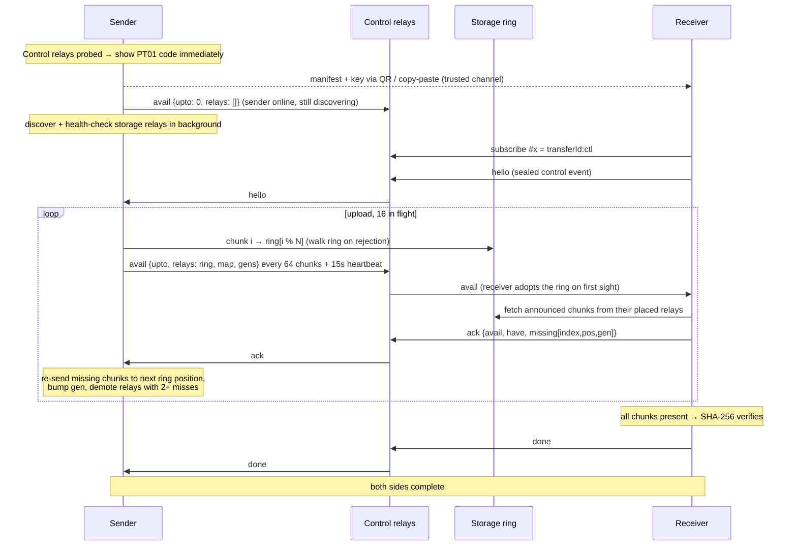

# Nostr File Relay Architecture

The Nostr file relay is an opt-in Manual Exchange variant (Advanced options → "Relay file
through Nostr", max 100 MB) that replaces the direct WebRTC connection with encrypted
pieces carried through public Nostr relays. The peers never connect to each other; both
only need internet access to the relays. It is experimental.

This document is the architecture reference. For the user-facing guide see
[MANUAL_EXCHANGE.md](MANUAL_EXCHANGE.md#experimental-relay-file-through-nostr);
for how this mode fits into the rest of the app see [ARCHITECTURE.md](ARCHITECTURE.md).
All code lives in [`src/lib/nostr-file/`](../src/lib/nostr-file/) (see the
[code map](#code-map) at the end).

## Overview

Two separate relay sets do two different jobs:

- **Control relays** (2–4, embedded in the payload): a small set of proven signaling
  relays, picked from `DEFAULT_RELAYS` after a quick small-event probe. They carry only
  the encrypted control channel — a relay that caps event sizes or rate-limits large
  writes (fine for signaling, useless for 32 KiB chunks) still serves perfectly here.
- **Storage relays** (the ring, up to 16, discovered): hold the encrypted pieces. The
  ring is *not* in the payload — the sender announces it over the control channel.

The sender hands out the code (payload `type: 'nostr-file-live'`) as soon as the control
relays pass their probe — storage-relay discovery runs in the background while the user
shares the code — and then keeps running: each piece is uploaded **once** while the
receiver downloads alongside, and the two sides coordinate over the control channel.
Redundancy is created on demand — a piece is re-sent only after the receiver
reports it could not fetch it, so the upload costs ~1× the file size plus the failed
pieces. Both pages stay open until the receiver confirms the verified file; the receiver
gets the full hour because the clock and the code start together.

## Shared Foundations

### Control relay probe (`upload.ts`, `relay-pool.ts`)

`resolveControlRelays` probes the `DEFAULT_RELAYS` seeds with the same write→read
round trip as the storage health check but at `CONTROL_PROBE_BYTES` (256 B) and a short
`CONTROL_PROBE_TIMEOUT_MS` (4 s) — read-back matters because the control channel relies
on relays *serving* the stored backlog, not just accepting writes. The fastest
`CONTROL_RELAY_COUNT` (4) passers go into the payload; fewer than `MIN_CONTROL_RELAYS`
(2) refuses the transfer. No discovery, no rotation — this runs before the code is
handed out, so it stays quick.

### Storage relay discovery and health check (`relay-pool.ts`)

1. **Discover candidates** via NIP-66 relay-discovery events (kind 30166) and NIP-65 relay
   lists (kind 10002) queried against the seed relays (`DEFAULT_RELAYS` from
   `src/lib/nostr/relays.ts`). The seeds themselves are always part of the result, so
   discovery failure degrades to seeds-only rather than failing the transfer. Candidates
   are capped (`DISCOVERY_CANDIDATE_CAP` = 150) and cached in localStorage for 24 h
   (`ptransfer:nostr-file:relay-pool:v1`).
2. **Health-check candidates** with a real write→read round trip per relay: a
   production-shaped probe event through the full codec at the full chunk size
   (`HEALTH_CHECK_PROBE_BYTES` = 32 KiB), read back and byte-compared. A relay with a
   small event-size cap therefore fails here instead of rejecting real chunks mid-upload.
   Probes carry the same NIP-40 expiration as everything else. Checking stops once
   `HEALTH_CHECK_TARGET_COUNT` (20) relays pass — some rotation headroom without probing
   the whole candidate list (only ~1 in 6 public candidates passes the full-size probe).
   Per-relay round-trip time is measured (`HealthyRelay.rttMs`) and the fastest passers
   are kept.
3. **Select the batch**: up to `UPLOAD_RELAY_COUNT` (16) relays via a rotating cursor
   persisted with the candidate cache, load-balancing across uploads. The minimum viable
   batch is two relays. The batch order **is the placement ring**, announced to the
   receiver inside every `avail` control message (never stored in the manifest).

### Chunking and content codec (`codec.ts`, `z85.ts`)

The plaintext (file or ZIP, materialized in memory, ≤ 100 MB) is split into
`NOSTR_FILE_CHUNK_SIZE` = 32 KiB chunks. Each chunk goes through:

```
deflate → AES-256-GCM (nonce ‖ ciphertext ‖ tag) → Z85
```

- The AES-256-GCM key is random per transfer and travels **only** inside the manual
  payload, never to relays.
- AAD = `ptransfer-nostr-file:v1:<transferId>:<index>:<total>` binds every chunk to its
  transfer and position — a tampered, substituted, or misplaced chunk fails GCM and is
  simply treated as missing.
- Z85 (base85): ~1.25× expansion vs base64's ~1.33×, and JSON-escape free. A 32 KiB
  incompressible chunk encodes to ~41 KB, comfortably under the ~64 KB
  event-content ceiling the public relay population is known to accept. A 100 MB file is
  3200 chunks.

### Chunk event schema (`events.ts`)

Chunks (and health probes) are NIP-78 addressable events, kind `30078`:

| Tag | Value |
|-----|-------|
| `d` | `<transferId>:<chunkIndex>` (derived — the manifest needs no per-chunk event ids) |
| `x` | `<transferId>` |
| `chunk` | `<index> <totalChunks>` |
| `encryption` | `deflate+aes-256-gcm` |
| `expiration` | `created_at + 3600` (NIP-40) |

Events are signed by an ephemeral Nostr identity generated per transfer, and deliberately
carry no filename, size, or plaintext hash — file metadata travels only inside the manual
payload, and the random `transferId` (rather than the file hash) prevents known-file
confirmation against public relays.

**Every published event carries the NIP-40 `expiration` tag (1 hour), health-check probes
and control messages included** — this mode never asks relays to hold data beyond one
transfer window. The 1-hour value is a client-enforced transfer deadline plus a deletion
*request*: compliant relays stop serving and prune expired events, but NIP-40 does not
guarantee deletion or provide cryptographic erasure — a non-compliant relay could retain
its copy. Confidentiality never depends on relay deletion: chunks orphaned by a cancelled
or failed upload are AES-256-GCM ciphertext under a key that was never published.

### Manifest and payload (`manifest.ts`, `manual-signaling.ts`)

The `NostrFileManifest` (v4) travels inside the PT01 manual payload and is never
published: version, file name/size/MIME, base64 SHA-256 of the plaintext, `transferId`
(16 random bytes, hex), the ephemeral pubkey, chunk size, total chunks, the control
relays (2–4), and created/expiry timestamps. The storage ring is not in it — it arrives
over the control channel. The payload wrapper (`NostrFileLivePayload`) adds `type` and
the base64 AES key — ~300 bytes total, a single QR code.

Because chunk `d` tags are derived from `transferId` and index, the manifest needs no
per-chunk event pointers; integrity comes from the per-chunk GCM tags plus the whole-file
hash, authenticity from Nostr signatures under the manifest's pubkey.

The receiver auto-detects the payload type on paste/scan (`parseAnyManualPayload`) — there
is no separate receive mode, and unlike normal Manual Exchange there is **no answer step**.

### Expiry and clocks

Everything must finish within `NOSTR_FILE_EXPIRATION_SEC` (1 hour) of the transfer start.
The receiver rejects an expired manifest up front, tolerating
`CLOCK_SKEW_TOLERANCE_SEC` (±10 min) of wall-clock disagreement. Both UIs show the
remaining time. The code is handed out at the start, so the receiver gets the full hour.

## Transfer Protocol (`upload-live.ts` / `download-live.ts` / `control.ts`)

### Control channel (`control.ts`)

Both peers derive an AES-256-GCM control key from the file key in the payload (HKDF, info
`ptransfer-nostr-file:v1:control`, salt = `transferId`), so only the code holder can read
or forge control messages.

Messages ride the payload's dedicated **control relays** (probed with a control-sized
event, so the same relay never has to accept both signaling and 32 KiB chunks) as
addressable events of the chunk kind with a unique `d` tag per message
(`<transferId>:ctl:<role>:<n>`), an `x` tag `<transferId>:ctl` for the subscription
filter, and the usual NIP-40 expiration; they carry the sealed, deflated JSON as base64.
Because they are stored, a peer that subscribes late or whose socket dropped
(`SimplePool` runs with reconnect enabled) recovers the backlog through the `since`
filter. Control messages publish to every control relay and count as delivered at the
first acceptance.

Anti-replay/misuse properties:

- The AAD binds every message to the transfer and the sending role — a receiver message
  can never replay as a sender message
- A per-side monotonic counter `n` rejects replays and reordering within a role
- The sender pins the first receiver pubkey that produces a valid message and ignores all
  others

### Message vocabulary

| Message | Direction | Fields | Meaning |
|---|---|---|---|
| `hello` | receiver → sender | `n` | Receiver is online and subscribed |
| `avail` | sender → receiver | `n`, `upto`, `relays`, `map`, `gens` | Chunks `[0, upto)` are uploaded. `relays` is the storage ring in placement order (empty while discovery is still running — presence only; the receiver adopts the first non-empty ring and drops any avail naming a different one); `map` has one character per chunk giving the position in this message's `relays` of the relay holding it (`POSITION_ALPHABET`, bounding the ring at 64 relays); `gens` lists re-sent chunks with their current generation |
| `ack` | receiver → sender | `n`, `avail`, `have`, `missing` | Outcome of fetching what avail `avail` announced: total chunks held, plus `missing` as `[index, pos, gen]` triples — tried at that exact placement and not found / not decryptable |
| `done` | receiver → sender | `n` | Whole-file SHA-256 verified |
| `cancel` | either side | `n` | Abort |

The complete ring and placement travel in every `avail`, so a lost announcement costs
nothing; bodies are deflated before sealing, which collapses the near-periodic map and
the shared-prefix relay URLs to a few hundred bytes even for 3200 chunks.

### Sender loop

The control channel opens and the code goes out right after the control probe; the first
`avail` (empty ring) is sent immediately so a receiver who pastes the code early sees the
sender is online while storage discovery finishes. Once the ring is selected, chunk `i`
is published to `ring[i % N]`, walking the ring on rejection until one relay
accepts (16 in flight); each publish retries up to 3× per relay with exponential backoff
(500 ms base, 5 s cap, 250 ms jitter). An `avail` is announced every `LIVE_BATCH_CHUNKS`
(64) chunks (2 MiB) and on completion, and repeated as a `LIVE_HEARTBEAT_MS` (15 s)
heartbeat so a lost announcement or acknowledgement in either direction is recovered on
the next beat.

**Re-sends.** An `ack` whose `missing` entry matches the chunk's *current* placement
queues a re-send (entries for a placement already replaced are ignored — the receiver
simply has not seen the newer announcement yet); the re-send starts from the next ring
position after the last attempt, bumps the chunk's generation `gen`, and goes out ahead of
new chunks with the next announcement.

**Relay demotion.** Misses are also counted per relay: a relay reported
`LIVE_RELAY_DEMOTE_MISSES` (2) times is **demoted** — it acknowledged the writes but does
not serve them (ephemeral or read-restricted relays pass the write→read health probe yet
behave this way under load), so new chunks and re-sends skip it while any other relay
remains, and the placement walk tries healthy relays first. Without this, a ring with
several such relays re-sends a third or more of a large file; with it, only the chunks
already placed there before the first acknowledgement need a second copy.

**Abort conditions.** A chunk re-sent more than `max(N, LIVE_MIN_RETRANSMITS_PER_CHUNK)`
times, a chunk no relay accepts, expiry, or the receiver falling silent for
`LIVE_IDLE_TIMEOUT_MS` (3 min) after the upload completed all abort the transfer; the
sender completes on `done`.

### Receiver loop

On each `avail`, the receiver fetches every announced chunk it lacks from the one relay it
was placed on (grouped per relay, in parallel, `authors` + `#d` filters, ≤
`D_TAG_FILTER_BATCH` (50) ids per filter, ~2 MB of content per query), skipping chunks
whose `(pos, gen)` it already tried, then answers with an `ack` listing what is still
missing at the placement it actually asked — never the newest announced one, so an
announcement landing mid-fetch cannot blame a relay this cycle never queried.
Announcements that arrive mid-fetch coalesce into one more cycle. When every chunk is
present the assembled file must match the manifest's SHA-256 before `done` is sent.
Expiry, or a sender silent for 3 minutes, aborts.



## Security Model

- **Relays see**: ciphertext, chunk count/sizes, timing, an ephemeral pubkey, the sealed
  control messages, and the two peers' activity timing — never plaintext, filenames, or
  the file hash
- **The code IS the key**: unlike the WebRTC signaling payload (obfuscated, but key
  material is only ECDH public keys), this payload **contains the decryption key**, so
  the trusted-channel requirement is absolute: anyone holding the payload before expiry
  can download and decrypt
- **Integrity**: per-chunk AES-GCM tags under a position-binding AAD, plus the whole-file
  SHA-256 in the manifest. Control messages are sealed under a role-binding AAD with
  per-side monotonic counters
- **Availability is best-effort**: relays may drop data before the 1-hour expiry;
  targeted re-sends mitigate this but do not guarantee delivery — the data is temporary
  by design, so durability is traded for relay load

## Limits and Tunables (`constants.ts`)

| Constant | Value | Meaning |
|---|---|---|
| `NOSTR_FILE_MAX_BYTES` | 100 MiB | Hard cap on the plaintext payload |
| `NOSTR_FILE_CHUNK_SIZE` | 32 KiB | Plaintext chunk size (~41 KB encoded) |
| `EVENT_KIND_FILE_CHUNK` | 30078 | NIP-78 addressable kind for chunks, probes, and control |
| `NOSTR_FILE_EXPIRATION_SEC` | 3600 | NIP-40 lifetime on every event; transfer deadline |
| `UPLOAD_RELAY_COUNT` | 16 | Storage relay batch per upload (placement ring size) |
| `MIN_UPLOAD_RELAYS` | 2 | Fewest usable storage relays for an upload to start |
| `CONTROL_RELAY_COUNT` | 4 | Control relays embedded in the payload |
| `MIN_CONTROL_RELAYS` | 2 | Fewest usable control relays for a send to start |
| `CONTROL_PROBE_BYTES` | 256 | Control probe payload (a sealed control message is a few hundred bytes) |
| `CONTROL_PROBE_TIMEOUT_MS` | 4 s | Control probe timeout — bounds code-ready time when a seed is dead |
| `PUBLISH_MAX_RETRIES` | 3 | Per-relay publish retries (backoff 500 ms → 5 s + jitter) |
| `UPLOAD_CHUNK_CONCURRENCY` | 16 | Chunks in flight |
| `HEALTH_CHECK_TARGET_COUNT` | 20 | Stop probing once this many relays pass |
| `D_TAG_FILTER_BATCH` | 50 | Max `d` ids per fetch filter (~2 MB per query) |
| `LIVE_BATCH_CHUNKS` | 64 | Chunks per `avail` announcement (2 MiB) |
| `LIVE_HEARTBEAT_MS` | 15 s | Re-announce cadence when nothing changed |
| `LIVE_IDLE_TIMEOUT_MS` | 3 min | Give up on a silent peer |
| `LIVE_MIN_RETRANSMITS_PER_CHUNK` | 4 | Floor on re-sends per chunk before failing (actual: `max(N, 4)`) |
| `LIVE_RELAY_DEMOTE_MISSES` | 2 | Reported misses before a relay is demoted |
| `CLOCK_SKEW_TOLERANCE_SEC` | ±600 | Tolerated sender/receiver wall-clock disagreement |

## Code Map

| File | Role |
|---|---|
| `src/lib/nostr-file/constants.ts` | All tunables above, with rationale comments |
| `src/lib/nostr-file/codec.ts`, `z85.ts` | Chunk content pipeline (deflate → AES-256-GCM → Z85) |
| `src/lib/nostr-file/events.ts` | Chunk/probe event construction and fetch filters |
| `src/lib/nostr-file/manifest.ts` | Manifest schema/validation |
| `src/lib/nostr-file/relay-pool.ts` | NIP-66/65 discovery, health probes, batch selection |
| `src/lib/nostr-file/pool.ts`, `mock-pool.ts` | `NostrFilePool` abstraction + in-memory relay network for tests |
| `src/lib/nostr-file/upload.ts` | Publish-with-retry, control-relay probe (`resolveControlRelays`), storage-ring resolution (`resolveUploadRelays`) |
| `src/lib/nostr-file/upload-live.ts`, `download-live.ts`, `control.ts` | Transfer engines + control channel |
| `src/lib/nostr-file/fetch.ts` | Relay chunk fetching (expiry check, filter batching) |
| `src/lib/nostr-file/sync.ts` | `Deferred`/`Signal` async helpers |
| `src/hooks/use-nostr-relay-live-send.ts` | Sender hook |
| `src/hooks/use-nostr-relay-receive.ts` | Receiver hook (payload auto-detected) |
| `src/hooks/nostr-relay-source.ts` | Source materialization / progress estimation |
| `src/lib/manual-signaling.ts` | `NostrFileLivePayload` PT01 framing |

Payload detection and routing into these hooks happens in the normal Manual Exchange
receive flow (`parseAnyManualPayload` → `receive-tab.tsx`). Tests are colocated
(`src/lib/nostr-file/*.test.ts`) and run against the injectable in-memory relay network in
`mock-pool.ts`; end-to-end coverage against real relay behavior lives in
`tests/live_nostr_file_e2e.ts`.
